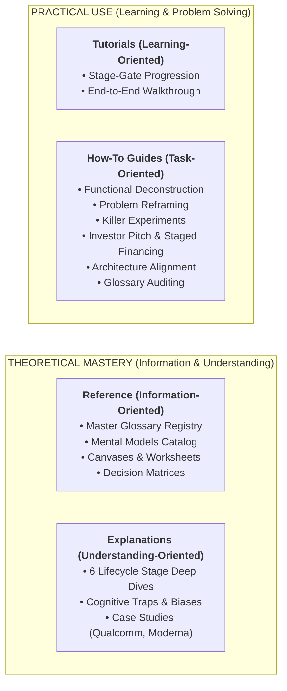
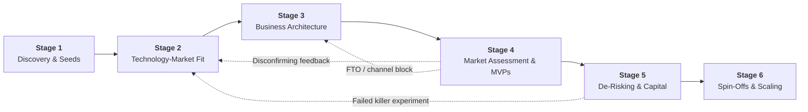

# Innovation Research & Lab-to-Market Documentation Hub

> **The Central Knowledge Base, Semantic Registry, and Operational Engine for Technology Entrepreneurship, Deep-Tech Translation, and Breakthrough Venture Building**  
> *Synthesized from Harvard Business School (HBS LBTechX1), UC San Diego, Flagship Pioneering, Gen5 Group, and Atlas Venture frameworks.*

---

## 🎯 Purpose & Architectural Scope

This repository serves as a formalized, Diátaxis-compliant documentation and research engine designed to solve the commercialization crisis: bridging the **Valley of Death** between laboratory invention and scalable market adoption.

It provides four foundational pillars:
1. **Semantic Rigor (Glossaries System):** A curated master lexicon of 95+ innovation terms with an automated Python coverage linter to detect missing glossaries and terminology gaps.
2. **Cognitive Clarity (Mental Models):** A catalog of 22 governing mental models, mathematical formulas, axioms, and 19 diagnostic failure modes/anti-patterns.
3. **Operational Discipline (Innovation Structures):** Practical decision canvases, multi-criteria matrices, and worksheets to structure commercialization.
4. **Lifecycle Staging (6 Stages of Innovation):** An end-to-end stage-gate architecture spanning benchtop discovery to institutional VC syndicates and category standards.

---

## 🏛️ Diátaxis Documentation Framework

This repository is structured according to the international **Diátaxis Documentation Framework**, organizing knowledge into four distinct user needs:



| Diátaxis Quadrant | User Orientation | Repository Directory & Core Artifacts |
|---|---|---|
| **Tutorials** | *Learning by Doing* | [**`stages/index.md`**](./stages/index.md) (Step-by-step navigation of the 6 stages of commercialization). |
| **How-To Guides** | *Problem Solving* | [**`guides/`**](./guides/) (Actionable playbooks: functional deconstruction, P-H reframing, killer experiments, investor pitching & staged financing, alignment audit, glossary auditing). |
| **Reference** | *Fact Lookup* | [**`glossaries/master-glossary.md`**](./glossaries/master-glossary.md), [**`mental-models/mental-models-catalog.md`**](./mental-models/mental-models-catalog.md), [**`structures/`**](./structures/). |
| **Explanations** | *Conceptual Context* | [**`stages/stage-*.md`**](./stages/), [**`mental-models/cognitive-traps-and-anti-patterns.md`**](./mental-models/cognitive-traps-and-anti-patterns.md). |

---

## 🔄 The 6 Stages of Lab-to-Market Translation



| Stage | Title | Core Focus & Theoretical Anchor | Guide |
|:---:|---|---|:---:|
| **1** | **Discovery & Seeds** | TRL 1–3 proof-of-concept; avoiding the invention-centric trap. | [`stage-1-discovery-and-seeds.md`](./stages/stage-1-discovery-and-seeds.md) |
| **2** | **Technology-Market Fit** | Framing search spaces via P-H pairs, functional deconstruction (S-A-O) & customer activity chains. | [`stage-2-technology-market-fit.md`](./stages/stage-2-technology-market-fit.md) |
| **3** | **Business Architecture** | Aligning Business Model (Value Creation/Capture) with Operating Model. | [`stage-3-business-architecture.md`](./stages/stage-3-business-architecture.md) |
| **4** | **Market Assessment & MVPs** | Cloverleaf due diligence, FTO clearance, 100-interview funnel & deep-tech MVP probing. | [`stage-4-market-assessment-and-mvp.md`](./stages/stage-4-market-assessment-and-mvp.md) |
| **5** | **De-Risking & Capital** | The firm as a cash engine (CCC), killer experiments, staged financing & investor alignment. | [`stage-5-venture-derisking-and-capital.md`](./stages/stage-5-venture-derisking-and-capital.md) |
| **6** | **Spin-Offs & Scaling** | Clean TTO IP assignment, accelerator sprints, VC syndicates & standards wars. | [`stage-6-spinoffs-and-scaling.md`](./stages/stage-6-spinoffs-and-scaling.md) |

---

## 📚 Glossaries & Lexicon Management

Ambiguity in terminology kills ventures. The repository features a unified semantic engine:

- **[Master Glossary Registry](./glossaries/master-glossary.md):** 95+ primary terms, aliases, mathematical formulas, originators, and anti-patterns indexed across all 7 stages.
- **[Glossary Auditing Guide](./glossaries/glossary-detection-guide.md):** The 3-question filter for identifying undefined concepts in notes and whitepapers.
- **Automated CLI Coverage Tool:** Run the linter to verify cross-references and detect missing terms:
  ```bash
  python3 vite-book/glossaries/check-glossary-coverage.py
  ```

---

## 🧠 Mental Models & Cognitive Architecture

- **[Mental Models Catalog](./mental-models/mental-models-catalog.md):** 22 definitive paradigms including the Biological Evolution of Ideas, P-H Landscape Search, Magic Square Coordinate Transformations, Scott Page's Diversity Theorem, the 10x Imperative, Ramana Nanda's Lemonade Stand Working Capital Model, Strategy-Financing Co-Determination, Sahlman's Pie Axiom, and Deep-Tech Experiment Cost-Collapse.
- **[Cognitive Traps & Anti-Patterns](./mental-models/cognitive-traps-and-anti-patterns.md):** 19 systematic biases and organizational failure modes (Reasonableness Trap, Better Mousetrap Fallacy, Hammer seeking a Nail, Safe Small-Ball Pitch Trap, Share Count Illusion, Capital Abundance Trap, Cash-Exhaustion Negotiation Trap, Fund-Horizon Friction, etc.).

---

## 🛠️ Actionable Structures, Canvases & Matrices

- **[Canvases & Worksheets](./structures/canvases-and-worksheets.md):**
  1. *P-H Search Space Canvas*
  2. *Universal Functional Analysis (S-A-O) Worksheet*
  3. *Customer Activity Chain & Linkages Worksheet*
  4. *Business Architecture Alignment Canvas*
  5. *Cloverleaf Due Diligence Diagnostic Scorecard*
  6. *Deep-Tech MVP & Killer Experiment Canvas*
  7. *Cash Engine & Working Capital Calculator*
  8. *Investor Counterparty Alignment & Incentive Audit*
  9. *Staged Milestone & Experiment Financing Roadmap*
  10. *Fully Diluted Ownership & Cap Table Planner*
- **[Decision Matrices](./structures/decision-matrices.md):**
  - *Commercialization Pathway Matrix* (Product vs. Service vs. Platform vs. IP Licensing)
  - *Capital Instrument Decision Matrix* (Customer Prepayments vs. Grants vs. Debt vs. Equity)
  - *GTM Entry Route Matrix* (Direct Disruption vs. OEM Channel vs. Corporate Spin-Off)

---

## 📖 Diátaxis How-To Playbooks

Step-by-step procedural guides for critical commercialization activities:
- [**How to Deconstruct Technology Seeds**](./guides/how-to-deconstruct-technology-seeds.md): Strip jargon, extract S-A-O triads, and query cross-industry patents.
- [**How to Reframe Stuck Problems**](./guides/how-to-reframe-stuck-problems.md): Apply the Magic Square principle and draft crowdsourced challenge briefs.
- [**How to Design Killer Experiments**](./guides/how-to-design-discriminating-experiments.md): Formulate invalidation criteria and deploy Wizard of Oz prototypes.
- [**How to Audit Business Architecture**](./guides/how-to-audit-business-architecture.md): Stress-test unit contribution margins and operating capabilities.
- [**How to Audit & Expand Glossaries**](./guides/how-to-audit-and-expand-glossaries.md): Detect missing glossaries and register new terms.

---

## 📁 Repository Directory Map

```tree
innovation-research/
├── README.md                                    # Central Master Portal & Diátaxis Hub
├── vite-book/                                   # Dedicated VitePress Documentation Site Root
│   ├── .vitepress/                              # VitePress site configuration, theme & plugins
│   ├── index.md                                 # Site home portal & Diátaxis quad-map
│   ├── assets/                                  # System diagrams, architecture charts & visuals
│   ├── stages/                                  # Innovation Lifecycle Stages (Explanations & Tutorials)
│   │   ├── index.md                             # Lifecycle map & stage-gate progression matrix
│   │   ├── stage-1-discovery-and-seeds.md       # Stage 1: Scientific Discovery & Seeds (TRL 1-3)
│   │   ├── stage-2-technology-market-fit.md     # Stage 2: Technology-Market Fit & Needs-Seeds Synchronization
│   │   ├── stage-3-business-architecture.md     # Stage 3: Business Architecture Design
│   │   ├── stage-4-market-assessment-and-mvp.md # Stage 4: Market Assessment & Deep-Tech MVPs
│   │   ├── stage-5-venture-derisking-and-capital.md # Stage 5: Cash Engine & Staged Financing
│   │   └── stage-6-spinoffs-and-scaling.md      # Stage 6: Spin-Offs, Syndicates & Standards
│   ├── glossaries/                              # Glossaries & Lexicon Management (Reference & Tooling)
│   │   ├── index.md                             # Glossary system portal
│   │   ├── master-glossary.md                   # Comprehensive 60+ term master glossary
│   │   ├── glossary-detection-guide.md          # Missing glossary detection protocol
│   │   └── check-glossary-coverage.py          # Automated CLI audit & missing-term scanner
│   ├── mental-models/                           # Cognitive Models & Traps (Reference & Explanation)
│   │   ├── index.md                             # Mental models portal
│   │   ├── mental-models-catalog.md             # 17 core mental models, formulas & axioms
│   │   └── cognitive-traps-and-anti-patterns.md # 14 failure modes, fallacies & antidotes
│   ├── structures/                              # Structures & Decision Frameworks (Reference & Tooling)
│   │   ├── index.md                             # Structures portal
│   │   ├── canvases-and-worksheets.md           # 7 actionable canvases & worksheets
│   │   ├── decision-matrices.md                 # 3 multi-criteria decision matrices
│   │   └── five-different-capital-types.md           # Capital taxonomy & selection architecture
│   └── guides/                                  # Diátaxis How-To Playbooks (How-To Guides)
│       ├── how-to-deconstruct-technology-seeds.md # Functional deconstruction playbook
│       ├── how-to-reframe-stuck-problems.md     # P-H reframing & crowdsourcing playbook
│       ├── how-to-design-discriminating-experiments.md # Deep-tech MVP & killer experiment playbook
│       ├── how-to-audit-business-architecture.md # Business architecture alignment playbook
│       ├── how-to-audit-and-expand-glossaries.md # Glossary audit & expansion playbook
│       └── how-to-conduct-stage-gate-audit.md   # Venture project stage-gate audit playbook
├── templates/                                   # Standardized Authoring Templates (Excluded from web docs)
│   └── research-template.md                     # Deep-dive research whitepaper template
├── research/                                    # Topic-specific whitepapers & research reports
└── notes/                                       # Raw signals, paper reading notes & observations
```

---

## 🔬 Research & Authoring Workflow

1. **Capture Signals:** Log early observations, papers, or lab findings in [`notes/`](./notes/).
2. **Deconstruct & Frame:** Use [`vite-book/guides/how-to-deconstruct-technology-seeds.md`](./vite-book/guides/how-to-deconstruct-technology-seeds.md) and [`vite-book/guides/how-to-reframe-stuck-problems.md`](./vite-book/guides/how-to-reframe-stuck-problems.md).
3. **Draft Deep Dive:** Copy [`templates/research-template.md`](./templates/research-template.md) into `research/<topic-slug>/README.md`.
4. **Audit Architecture:** Evaluate using the canvases in [`vite-book/structures/canvases-and-worksheets.md`](./vite-book/structures/canvases-and-worksheets.md).
5. **Run Stage-Gate Due Diligence:** Score the venture using [`vite-book/guides/how-to-conduct-stage-gate-audit.md`](./vite-book/guides/how-to-conduct-stage-gate-audit.md).
6. **Audit Glossary Coverage:** Run `python3 vite-book/glossaries/check-glossary-coverage.py` to ensure all concepts resolve cleanly to [`vite-book/glossaries/master-glossary.md`](./vite-book/glossaries/master-glossary.md).
