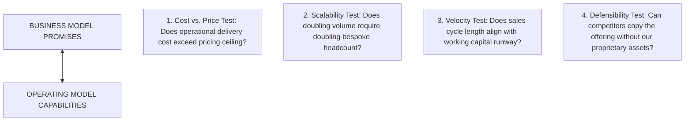

# How-To Guide: Audit Business & Operating Model Alignment

> **Diátaxis How-To Guide:** Step-by-step instructions for diagnosing structural disconnects between what a venture promises to customers (Business Model) and what it is equipped to deliver (Operating Model).

---

## Prerequisites & Goal

- **Prerequisites:** A draft Business Model (pricing and customer value proposition) and a defined Operating Model (structure, capabilities, assets).
- **Goal:** Identify and resolve fatal misalignments between unit economics, operating cost structures, and organizational capabilities before launch.

---

## Step 1: Map the Business Model Vectors

Document the two vectors of your commercial premise:
1. **Value Creation:** Why will the customer buy? (Is it low price, 10x performance, white-glove personalization, or network effects?)
2. **Value Capture:** How does money flow into the company? (Unit sales, SaaS subscriptions, metered usage, licensing royalties, or outcomes-based cut?)
3. **Target Unit Contribution Margin:**
   $$\text{Gross Contribution Margin \%} = \frac{\text{Price per Unit} - \text{Direct Delivery Cost}}{\text{Price per Unit}} \times 100$$

---

## Step 2: Audit the Operating Model Triad

Review the execution engine required to fulfill the business model:
1. **Structure Check:**
   - Are you organized as a **Product Firm**, a **Service Firm**, or a **Platform Matchmaker**?
   - *Test:* Does your organizational overhead match your revenue model? (e.g., A product pricing model cannot sustain a custom consulting headcount).
2. **Capabilities Audit:**
   - What are the top 3 core competencies required to deliver the offering?
   - *Test:* Do you currently employ these proficiencies, or are you assuming you will hire them easily?
3. **Assets Verification:**
   - What proprietary physical, digital, or IP assets are necessary to defend this position?
   - *Test:* Are these assets legally protected (granted patents, exclusive data rights)?

---

## Step 3: Run the 4 Alignment Stress Tests

| Stress Test | Passing Signal | Failing Signal (Fatal Disconnect) |
|---|---|---|
| **1. Cost vs. Price** | Direct COGS $<20–30\%$ of price. | Delivering the product requires extensive manual customization that wipes out gross margins. |
| **2. Scalability** | Software or manufactured units scale without linear labor additions. | Scaling requires hiring linearly proportional domain specialists (looks like a software firm on paper, behaves like a law firm in reality). |
| **3. Velocity** | Cash collection occurs prior to operational expense (negative working capital). | 18-month enterprise sales cycles combined with Net-90 payment terms drain cash before receivables are collected. |
| **4. Defensibility** | Value capture is shielded by strong IP or proprietary data network effects. | Solution is easily cloned by established incumbents once demand is proven. |

---

## Step 4: Execute the Realignment

If any stress test fails:
1. **Adjust the Pricing Model:** Switch from fixed one-time pricing to recurring subscriptions or outcomes-based performance shares.
2. **Standardize the Operating Structure:** Eliminate bespoke customization; force modular software interfaces or automated onboarding.
3. **Outsource Non-Core Activities:** Transition capital-intensive asset fabrication to contract foundries (fabless architecture).
