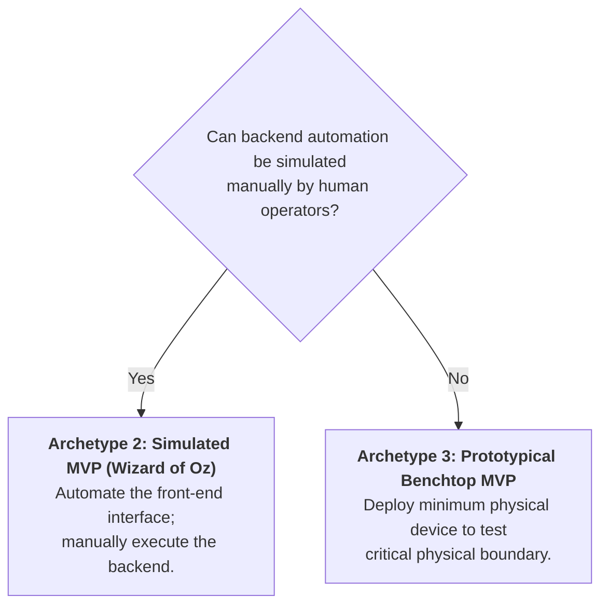

# How-To Guide: Design Killer Discriminating Experiments for Deep Tech

> **Diátaxis How-To Guide:** Step-by-step instructions for isolating existential venture assumptions, choosing the right deep-tech MVP archetype, and executing tests that maximize validated learning per dollar burned.

---

## Prerequisites & Goal

- **Prerequisites:** A technological capability (TRL 3–5) and a candidate value proposition.
- **Goal:** Design and execute an empirical experiment in ≤ 14 days for < \$5,000 that decisively validates or invalidates your primary commercial hypothesis before burning significant capital.

---

## Step 1: Identify the Existential "Leap of Faith" Assumption

1. Assemble the founding team for an **Assumption Pre-Mortem**.
2. Complete this statement:
   > *"If we wake up in 2 years and this company has failed completely, what was the single technical, behavioral, or economic assumption that turned out to be false?"*
3. Categorize candidate assumptions:
   - **Physics / Biology Limit:** Can the system achieve required fidelity?
   - **Customer Behavioral Willingness:** Will operators change their daily habit?
   - **Economic Viability:** Will the buyer pay more than the delivery cost?
4. Select the assumption with the **highest uncertainty and highest lethality**.

---

## Step 2: Establish the Invalidation Threshold (Disconfirming Metric)

Define the exact numerical outcome that **kills** the hypothesis:
- *Bad (Vague):* *"We want to see if physicians like our AI triage summaries."*
- *Good (Discriminating Metric):* *"If > 25% of emergency physicians reject the automated summary and demand a full manual image re-read during an active night shift, the hypothesis is DECISIVELY KILLED."*

---

## Step 3: Select the Appropriate Deep-Tech MVP Archetype

### The Wizard of Oz Protocol (Simulated MVP):
1. Build a high-fidelity front-end interface (web portal, Slack bot, or mobile app).
2. Behind the scenes, place human domain experts (e.g., medical specialists, human logistics coordinators) to manually generate the outputs in real time.
3. Deliver the service to customers as if the AI or automated hardware were 100% operational.
4. **Validation Unlocked:** You test customer adoption, trust, and willingness to pay *before* spending millions to develop complex automated backends.

---

## Step 4: Execute with the "Think-Aloud" Protocol

1. Seat the target user in front of the MVP artifact in their natural work environment.
2. Instruct them: *"Please verbalize everything going through your mind as you perform this task. We are testing the tool, not you. If you get confused, it is the tool's fault."*
3. Observe without intervening:
   - Note hesitation pauses > 3 seconds.
   - Record where they click or search for missing data.
   - Record explicit expressions of mistrust or confusion.

---

## Step 5: Triage the Experimental Outcome

| Outcome | Experimental Data | Strategic Action |
|---|---|---|
| **Validated** | Re-read rate < 10%; customer requests pilot contract. | Advance to Stage 6 (Raise staged capital for backend engineering). |
| **Ambiguous** | Re-read rate 15–25%; users praise concept but hesitate. | Iterate front-end UI; re-test with 10 additional users. |
| **Decisively Invalidated** | Re-read rate > 30%; users refuse to rely on output. | **KILL HYPOTHESIS IMMEDIATELY.** Pivot business architecture before capital is burned. |
