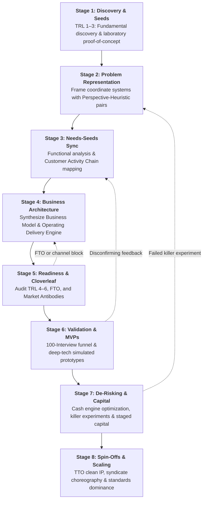

# The Innovation Lifecycle: 8 Stages of Lab-to-Market Translation

> **The Architectural Blueprint for Navigating Scientific Discovery, Customer Validation, Business Modeling, and Venture Financing**

---

## Executive Overview

Translating breakthrough science into an enduring, commercially viable enterprise is not a random guessing game. It is a disciplined, multi-stage engineering process characterized by **systematic uncertainty reduction**: extracting maximum validated market information for the minimum amount of sunk capital and time.

---

## Stage-Gate Progression Matrix

Each stage has rigorous **Entrance Criteria**, **Core Transformation Activities**, and **Exit Gate Deliverables** that must be achieved before committing significant capital to subsequent phases.

| Stage | Title | Core Objective | Primary Deliverable |
|:---:|---|---|---|
| [**1**](./stage-1-discovery-and-seeds.md) | **Discovery & Seeds** | Establish scientific proof-of-principle; isolate the raw technological seed. | Laboratory Proof-of-Concept (TRL 3); provisional patent filing. |
| [**2**](./stage-2-problem-framing-and-ph.md) | **Problem Representation** | Formulate multiple distinct P-H coordinate systems; avoid premature optimization. | P-H Search Matrix (at least 3–5 alternative representations). |
| [**3**](./stage-3-needs-seeds-synchronization.md) | **Needs-Seeds Sync** | Deconstruct technology into universal functions; discover urgent customer jobs. | S-A-O Functional Decomposition; Customer Activity Chain map. |
| [**4**](./stage-4-business-architecture.md) | **Business Architecture** | Design value creation/capture mechanics and align with the operating delivery engine. | Business Architecture Alignment Canvas; Unit Economics model. |
| [**5**](./stage-5-readiness-and-cloverleaf.md) | **Readiness & Due Diligence** | Stress-test venture viability across technology, market, IP/FTO, and operations. | Cloverleaf Diagnostic Audit; Freedom-to-Operate legal memo. |
| [**6**](./stage-6-customer-validation-and-mvp.md) | **Validation & MVPs** | Test customer willingness to pay using simulated artifacts and empirical interviews. | 100-Interview Synthesis; Wizard of Oz / Deep-Tech MVP test results. |
| [**7**](./stage-7-venture-derisking-and-capital.md) | **De-Risking & Capital** | Architect negative working capital; execute killer discriminating tests; stage capital. | Cash Engine (CCC) Architecture; Discriminating Experiment Plan. |
| [**8**](./stage-8-spinoffs-and-scaling.md) | **Spin-Offs & Scaling** | Clean institutional IP licensing; assemble balanced VC syndicate; establish category standard. | TTO License Agreement; Clean Cap Table; Series A Syndicate Term Sheet. |

---

## Stage Navigation Guide

- [`stage-1-discovery-and-seeds.md`](./stage-1-discovery-and-seeds.md): How to evaluate laboratory capabilities and avoid the "hammer in search of a nail" trap.
- [`stage-2-problem-framing-and-ph.md`](./stage-2-problem-framing-and-ph.md): How to use the Magic Square principle and cognitive diversity to frame high-leverage search spaces.
- [`stage-3-needs-seeds-synchronization.md`](./stage-3-needs-seeds-synchronization.md): How to apply Sam Kogan's functional analysis and Anthony Ulwick's ODI to align supply with demand.
- [`stage-4-business-architecture.md`](./stage-4-business-architecture.md): How to combine the Business Model with the Operating Model triad (Structure, Capabilities, Assets).
- [`stage-5-readiness-and-cloverleaf.md`](./stage-5-readiness-and-cloverleaf.md): How to deploy the Cloverleaf diagnostic and assess Freedom to Operate (FTO).
- [`stage-6-customer-validation-and-mvp.md`](./stage-6-customer-validation-and-mvp.md): How to execute the 100-interview funnel and build deep-tech Wizard of Oz MVPs.
- [`stage-7-venture-derisking-and-capital.md`](./stage-7-venture-derisking-and-capital.md): How to design the firm as a cash engine and execute hypothesis-driven staged financing.
- [`stage-8-spinoffs-and-scaling.md`](./stage-8-spinoffs-and-scaling.md): How to spin out from research institutions, survive accelerator sprints, and navigate VC syndicates.
