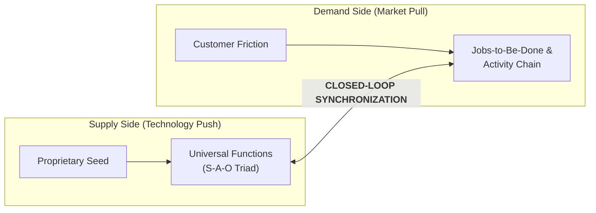

# Stage 3: Needs-Seeds Synchronization & Functional Analysis

> **Phase Focus:** Accelerated Innovation, Universal Functional Deconstruction (Dr. Sam Kogan), Jobs-to-Be-Done, and Customer Activity Chains (Prof. Vish Krishnan).

---

## 1. Stage Objective & Theoretical Foundation

Stage 3 bridges the supply side (what science can build) with the demand side (what customers urgently need). Relying exclusively on technology push ("a hammer in search of a nail") or market pull ("the faster horse trap") is what Vish Krishnan terms **"clapping with one hand."**

Accelerated innovation demands a closed-loop engine where functional capabilities are continuously synchronized with validated customer workflows.

---

## 2. Key Concepts & Definitions

- **Universal Functional Analysis (Functional Thinking):** A systematic method that strips away proprietary jargon and physical parts to define a technology strictly by what it *does* at an elementary physical level.
  - *Core Axiom:* **Function is the goal; technology is merely a means.**
- **Subject-Action-Object (S-A-O) Triad:** The semantic grammar of functional analysis: an active verb applied to a target object (e.g., *"separates hydrocarbon"*, *"stops impurities"*, *"transfers thermal energy"*).
- **Main Parameters of Value (MPV):** The 1–2 decisive quantifiable performance or cost metrics that govern customer purchase decisions.
  $$\text{Value} = \frac{\text{Utility / Performance}}{\text{Total Cost of Acquisition \& Ownership}}$$
- **Jobs-to-Be-Done (JTBD):** The fundamental operational or emotional goal a customer seeks to accomplish in a specific circumstance (Theodore Levitt's maxim: *"People don't want a quarter-inch drill bit; they want a quarter-inch hole"*).
- **Customer Activity Chain (Linkages-Driven Innovation):** The sequential end-to-end journey of operational steps a user executes: Search $\rightarrow$ Negotiate $\rightarrow$ Buy $\rightarrow$ Install $\rightarrow$ Operate $\rightarrow$ Maintain $\rightarrow$ Dispose.

---

## 3. Core Transformation Activities

1. **Deconstruct the Seed into Universal Functions:** Eliminate all trade names, materials chemistry, and domain-bound terminology. Express the core capability as active S-A-O triads.
2. **Execute Cross-Industry S-A-O Patent Queries:** Search global patent databases for industries that utilize identical elementary functions (e.g., cross-referencing fluid separation across municipal water, petrochemical processing, food manufacturing, and pulp/paper).
3. **Map the Customer Activity Chain:** Interview operators in target verticals to map the complete operational chain, diagnosing functional, economic, informational, and emotional friction at every single link.
4. **Identify the Decisive MPVs:** Determine the exact threshold of performance, yield, convenience, or cost required to compel a customer to displace their existing solution.

---

## 4. Case Study: Via Separations (Shreya Dave, MIT)

- **The Failure of Unidirectional Push:** Shreya Dave developed a graphene oxide membrane for water desalination. Market research revealed electricity was only a minor component of municipal desalination costs; the membrane saved almost nothing for operators.
- **The Functional Shift:** Deconstructing the seed to its universal function (*"mechanically separates molecules at ambient temperature"*), she discovered industrial thermal separations consume **12% of all US industrial energy**.
- **The Accelerated Loop:** Dave interviewed operators across 15 industries, selected pulp/paper and petrochemicals, discovered exact temperature/chemical tolerance requirements, and returned to the lab to tune the membrane specifications.

---

## 5. Stage Gate 3: Exit Deliverables

Before advancing to [**Stage 4: Business Architecture Design**](./stage-4-business-architecture.md), the venture must possess:
- [ ] Documented **Functional Deconstruction Worksheet** containing 3–5 universal S-A-O functions.
- [ ] Completed **Customer Activity Chain Map** for at least 2 candidate target verticals.
- [ ] Identified **Main Parameters of Value (MPVs)** with baseline and target numerical metrics.
- [ ] Validated that the opportunity targets an urgent, validated customer Job-to-Be-Done.
