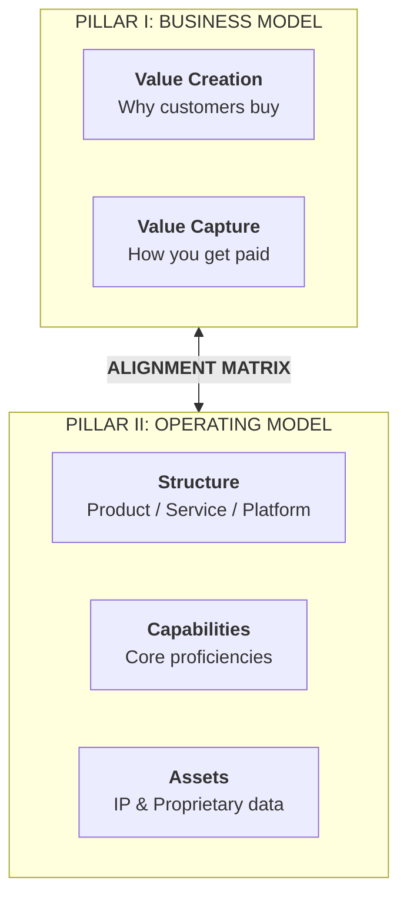

# Stage 4: Business Architecture Design & Model Alignment

> **Phase Focus:** Combining the Business Model (Value Creation & Capture) with the Operating Model (Structure, Capabilities, Assets) into a Defensible System.

---

## 1. Stage Objective & Theoretical Foundation

A superior technology matched with a validated customer need will still fail if wrapped in an untenable business architecture. Stage 4 transforms a technical capability into a sustainable, scalable economic enterprise.

> **The Xerox PARC Warning**  
> *"Xerox PARC invented the GUI, the mouse, Ethernet, and laser printing — but failed to capture their commercial value. Apple and Microsoft captured that value through superior business and operating models."*  
> — Prof. Karim Lakhani (Harvard Business School)

$$\text{Business Architecture} = \underbrace{\text{Business Model}}_{\text{Value Creation \& Capture}} + \underbrace{\text{Operating Model}}_{\text{Structure, Capabilities, Assets}}$$

---

## 2. Key Concepts & Definitions

- **Business Model:** How the firm creates value for customers and captures a sustainable portion of that value as revenue.
  - **Value Creation:** Mechanisms include differentiation, cost advantage, vertical focus, and direct/indirect network effects.
  - **Value Capture:** Monetization strategies include unit margin (cost-plus), licensing (IP rights), subscription (ARR), metered usage, transaction fees, and outcomes-based pricing.
- **Operating Model:** The delivery engine that operationalizes what was promised in the business model.
  - **Structure:** The organizational form (Product Firm, Service Provider, Platform/Marketplace).
  - **Capabilities:** Distinctive organizational knowledge (e.g., FDA regulatory engineering, clinical trial choreography, precision wafer manufacturing).
  - **Assets:** Proprietary physical, informational, and intellectual resources (e.g., granted patents, longitudinal training data, production plants).
- **Architectural Alignment:** The mathematical and operational harmony between what the business model promises and what the operating model delivers.

---

## 3. Core Transformation Activities

1. **Articulate the Value Creation Proposition:** Define whether customer surplus is driven by superior performance, convenience, cost reduction, or risk mitigation along validated MPVs.
2. **Select the Value Capture Mechanism:** Evaluate unit economics across candidate pricing models (e.g., assessing whether a hospital will buy volumetric AI via an annual software subscription, a per-scan fee, or an outcomes-based reimbursement share).
3. **Select the Operating Structure:** Decide whether to scale as a pure-play **Product Firm** (software/hardware widget), a high-touch **Service Firm** (bespoke consulting), or a **Two-Sided Platform** (matchmaker).
4. **Audit Business-Operating Model Alignment:** Use the alignment matrix to verify that the cost structure of the operating model does not exceed the pricing ceiling of the business model.

---

## 4. Alignment Diagnostic Matrix

| Strategy Posture | Business Model Dimensions | Required Operating Model Alignment |
|---|---|---|
| **Low-Cost Disruptor** | Aggressive price discounting, high transaction velocity. | Lean automated structure, outsourced production assets, metrics-driven logistics capabilities. |
| **White-Glove Enterprise** | Premium unit margins, multi-year SLAs. | Concierge solution-selling structure, deep regulatory capabilities, dedicated technical account assets. |
| **Platform Ecosystem** | Direct/indirect network effects, transaction fee capture. | Software matchmaker structure, developer platform APIs, self-service onboarding capabilities. |
| **Deep-Tech Licensing** | High gross margins, royalty per unit manufactured. | Lean R&D lab structure, strong patent litigation and cross-licensing capabilities, foundational IP assets. |

---

## 5. Stage Gate 4: Exit Deliverables

Before advancing to [**Stage 5: Market Assessment, Due Diligence & MVP Validation**](./stage-5-market-assessment-and-mvp.md), the venture must possess:
- [ ] Completed **Business Architecture Canvas** mapping both pillars.
- [ ] Preliminary **Unit Economics Model** (Contribution Margin = Revenue per unit - Direct delivery cost).
- [ ] Validated Operating Structure decision (Product vs. Service vs. Platform).
- [ ] Alignment Audit confirming the operating cost structure supports the value capture mechanism.
