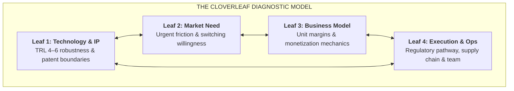

# Stage 5: Technology Readiness & Cloverleaf Due Diligence

> **Phase Focus:** Evaluating TRL 4–6 Milestones, Stress-Testing the Cloverleaf Framework, Securing Freedom to Operate (FTO), and Preparing for Incumbent Market Antibodies.

---

## 1. Stage Objective & Theoretical Foundation

Translating laboratory discoveries into markets is characterized by severe attrition: startup success rates hover around **10–15%**. Ventures fail not because their underlying science is invalid, but because markets respond to disruptive technologies much like biological hosts respond to foreign pathogens: with **aggressive, antibody-driven immune reactions**.

Stage 5 deploys systematic due diligence to stress-test the venture across technical, market, legal, and operational vectors before committing growth capital.

---

## 2. Key Concepts & Definitions

- **Technology Readiness Levels (TRL 4–6 Sweet Spot):**
  - *TRL 4:* Component/breadboard validation in laboratory environment.
  - *TRL 5:* Component/breadboard validation in relevant simulated operational environment.
  - *TRL 6:* System/subsystem model or prototype demonstration in a relevant operational environment.
- **The Cloverleaf Diagnostic Framework:** A multidimensional framework assessing:
  1. *Leaf 1:* Technology performance boundaries and scalability.
  2. *Leaf 2:* Authentic market demand and customer pain intensity.
  3. *Leaf 3:* Viable monetization and defensible pricing power.
  4. *Leaf 4:* Regulatory pathways, manufacturing readiness, and operational team.
- **Freedom to Operate (FTO):** Legal confirmation that practicing the commercial technology will not infringe active third-party patent claims.
  - *Critical Distinction:* Having a granted patent does *not* confer Freedom to Operate.
- **Market Antibodies:** Entrenched incumbent resistance (exclusive supplier contracts, regulatory lobbying, predatory pricing, patent litigation).
- **The 10x Imperative:** To break customer switching inertia and overcome market antibodies, a new technological offering must offer an **order-of-magnitude (10x)** improvement in cost, speed, or yield along at least one decisive MPV.

---

## 3. Core Transformation Activities

1. **TRL Milestone Audit:** Conduct rigorous bench-to-field testing, confirming the technology operates reliably outside pristine laboratory conditions.
2. **Execute a Comprehensive FTO Search:** Engage patent counsel to clear all product components against valid third-party claims, identifying potential blocking patents.
3. **Map Market Antibodies:** Identify incumbent corporations whose revenue will be threatened by adoption; anticipate regulatory, channel, and legal counter-measures.
4. **Evaluate the Patience Dilemma:** Verify that required ecosystem infrastructure (e.g., specialized supply chains, standards bodies) will mature before venture capital reserves run dry.

---

## 4. The 4-Leaf Due Diligence Checklist

| Leaf | Core Question | Red Flag Warning |
|---|---|---|
| **Leaf 1: Technology** | Does the technology function reliably under real-world noise and variable tolerances? | Prototype only works when operated by its original PhD inventor in the lab. |
| **Leaf 2: Market Need** | Does the customer experience active operational pain, and do they possess budget authority? | Customer acknowledges the problem but ranks it as a low priority (#8 or #10 on their list). |
| **Leaf 3: Business Model** | Can the enterprise capture positive unit contribution margin at current manufacturing scale? | Monetization depends entirely on massive, unproven economies of scale to achieve profitability. |
| **Leaf 4: Operations & IP** | Does the startup have unencumbered Freedom to Operate and a clear regulatory pathway? | An incumbent holds a broad patent covering the foundational mechanism. |

---

## 5. Stage Gate 5: Exit Deliverables

Before advancing to [**Stage 6: Customer Validation & Deep-Tech MVPs**](./stage-6-customer-validation-and-mvp.md), the venture must possess:
- [ ] Validated **TRL 5/6 Prototype** operating in a simulated or relevant field environment.
- [ ] Formal **Freedom to Operate (FTO)** audit conducted by patent counsel.
- [ ] Completed **Cloverleaf Due Diligence Scorecard** showing no fatal red flags across all four leaves.
- [ ] Documented **10x Advantage Verification** along decisive customer MPVs.
