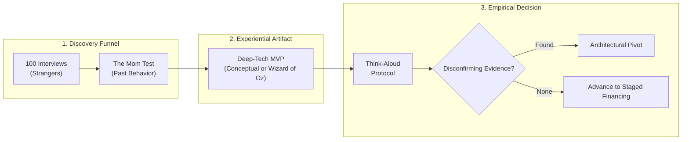
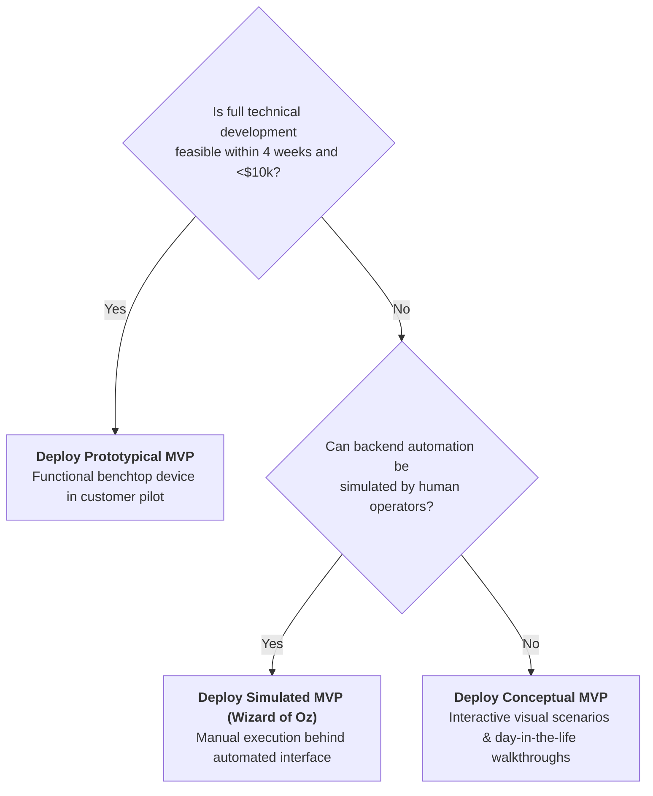

# Stage 6: Empirical Customer Validation & Deep-Tech MVPs

> **Phase Focus:** The 100-Interview Funnel, Rob Fitzpatrick's Mom Test Principles, Deep-Tech MVP Archetypes, and Extracting Disconfirming Evidence.

---

## 1. Stage Objective & Theoretical Foundation

In deep-tech and science-based ventures, the primary goal of early validation is **systematic uncertainty reduction**: extracting the maximum volume of validated customer learning for the least expenditure of capital and time.

> [!QUOTE] The Empirical Mandate
> Slide presentations produce false positives. Asking *"Would you buy a product that does X?"* costs the customer nothing to affirm. Customers must viscerally experience the future state of their workflow through tangible MVP artifacts to discover authentic operational friction. (Prof. Karim Lakhani & Tim Miano).

---

## 2. Key Concepts & Definitions

- **The 100-Interview Funnel:** A disciplined standard requiring founders to conduct at least 100 qualitative discovery interviews with ecosystem practitioners (operators, purchasing managers, clinical chiefs, regulators)—specifically strangers, never friends or family.
- **The Mom Test Principles:**
  1. Talk about their life and past behaviors, not your idea.
  2. Ask about specific instances in the past (*"When was the last time this happened? How much did it cost you?"*), never hypothetical futures (*"Would you like a tool that does X?"*).
  3. Listen more than you speak; deflect compliments and probe for workflow friction.
- **Disconfirming Evidence:** Experimental data or customer feedback that refutes the founder's core value hypothesis. High-performing founders actively hunt for disconfirming evidence early when burn rate is low.
- **Deep-Tech MVP Archetypes:**
  1. **Conceptual MVP:** Low-fidelity mockups, visual workflow maps, interactive scenario walkthroughs.
  2. **Simulated MVP (Wizard of Oz):** Front-end appears fully automated; human operators manually execute workflows behind the curtain to validate demand before building complex backends.
  3. **Prototypical MVP:** Minimum functional engineering prototype deployed to test core physical/algorithmic performance in the customer's actual environment.
- **Think-Aloud Protocol:** Having users narrate their live thoughts while interacting with an MVP artifact to observe authentic cognitive friction.

---

## 3. Core Transformation Activities

1. **Execute the 100-Interview Discovery Sprint:** Map the target vertical's multi-stakeholder ecosystem (users, economic buyers, IT/compliance gatekeepers, regulatory influencers).
2. **Eliminate Hypothetical Pitching:** Ban slide decks in early discovery meetings; conduct open-ended inquiries into existing operational workarounds.
3. **Build a Simulated MVP (Wizard of Oz):** Before spending $2M on machine learning training or custom hardware tooling, manually simulate the output delivery to test customer integration and willingness to pay.
4. **Extract Economic Commitments:** Measure validation not by verbal praise, but by economic sacrifice: letters of intent (LOIs), prepayments, access to proprietary test data, or pilot deposits.

---

## 4. Deep-Tech MVP Decision Tree

---

## 5. Stage Gate 6: Exit Deliverables

Before advancing to [**Stage 7: Venture De-Risking & Capital Architecture**](./stage-7-venture-derisking-and-capital.md), the venture must possess:
- [ ] Completed **100-Interview Funnel Log** documenting specific historical customer behaviors and budgets.
- [ ] Deployment and testing of at least one **Deep-Tech MVP Archetype** (Conceptual, Wizard of Oz, or Prototype).
- [ ] Documented **Think-Aloud Observation Findings** detailing workflow friction points.
- [ ] At least **3–5 Non-Binding Customer Commitments** (Letters of Intent, pilot agreements, or advance deposits).
