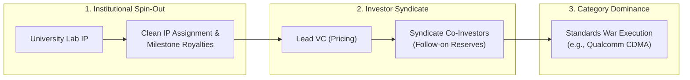

# Stage 8: Accelerators, Spin-Offs & Syndicate Governance

> **Phase Focus:** Tech Transfer Office (TTO) Licensing, Accelerator Sprints, VC Power Law Alignment, Syndicate Signaling Dynamics, and Standards Battles.

---

## 1. Stage Objective & Theoretical Foundation

Stage 8 governs the formal transition from an exploratory project into a scaled corporate entity. It addresses institutional friction: spinning IP out of universities, navigating accelerator dynamics, structuring investor syndicates, and fighting standards wars to achieve market dominance.

> [!QUOTE] The Syndicate Reality
> *"You've got all your eggs in that one basket. The VC has a portfolio. What your definition of success is can be very different from your investor's. You might feel a $50M exit is transformational; the VC might see that as a failure because they need a billion-dollar outcome to return their fund."*
> — Prof. Ramana Nanda (Harvard Business School)

---

## 2. Key Concepts & Definitions

- **Tech Transfer Office (TTO) Pitfalls:** Hazards in university licensing: aggressive upfront cash demands, excessive gross revenue royalty drag (5–10%), unassigned patent claims, and toxic cap tables (passive lab professors owning 40%+ of equity).
- **The Power Law ("The Hits Business"):** Institutional VC portfolio math where ~5% of investments generate ~80% of aggregate returns. Funds cannot support modest lifestyle exits; every investment must hold theoretical potential to return the fund ($>\$1\text{B}$).
- **The 10-Year Fund Lifecycle:**
  - *Years 1–3:* Capital deployment into initial portfolio companies.
  - *Years 4–7:* Follow-on capital reserved for top performers; triage of underperformers.
  - *Years 8–10:* Asset liquidation, M&A exits, or IPOs to return cash to Limited Partners (LPs).
- **Investor Syndicate Dynamics & Signaling Risk:** Co-investing with multiple VC firms. If an insider lead investor fails to participate in a subsequent financing round, it triggers severe **signaling risk** that can freeze outside capital.
- **Standards War:** A high-stakes commercial battle where competing technological architectures contest de facto industry standard status (e.g., Qualcomm CDMA vs. TDMA/GSM).

---

## 3. Core Transformation Activities

1. **Negotiate Clean Institutional IP Assignment:** Structure TTO agreements with commercial success milestones and equity-for-royalty conversions, preserving future venture gross margins.
2. **Cleanse the Cap Table:** Ensure operating founders hold voting control and active equity; vest all stock over a standard 4-year schedule with 1-year cliff.
3. **Assemble a Balanced Syndicate:** Partner with a reputable lead investor who takes a board seat and prices the round, complemented by value-add syndicate co-investors with deep sector expertise.
4. **Execute the Standards War Playbook:** As demonstrated by Qualcomm CDMA, if incumbents attempt to standardize on legacy architectures, pivot between licensing, chip design, and full-system manufacturing to force industry adoption.

---

## 4. Case Study: Qualcomm CDMA Commercialization

- **The Consensus Barrier (1989):** The global cellular industry (AT&T, Motorola, Ericsson, TIA) unanimously voted for TDMA in the US and GSM in Europe, declaring CDMA mathematically unworkable.
- **Retiring Technical Risk:** Irwin Jacobs demonstrated CDMA in a moving van in San Diego (November 1989), solving the near-far power control problem and multipath fading.
- **The Dallas Shootout (1991):** Qualcomm staged an undeniable head-to-head audio clarity demonstration against TDMA, shattering industry consensus.
- **Architectural Flexibility:** When manufacturers refused to build CDMA phones, Qualcomm built its own phone and base station factories, proving market demand before spinning those manufacturing units off to focus on high-margin IP licensing and chipsets.

---

## 5. Stage Gate 8: Venture Graduation Checklist

To achieve sustainable scale and corporate autonomy:
- [ ] Fully executed, clean **TTO License Agreement** with no onerous gross royalty penalties.
- [ ] Standardized cap table with 4-year vesting across all operational founders.
- [ ] Tier-1 Lead Investor secured with multi-round follow-on capital reserves.
- [ ] Clear regulatory and standards roadmap establishing category leadership.
