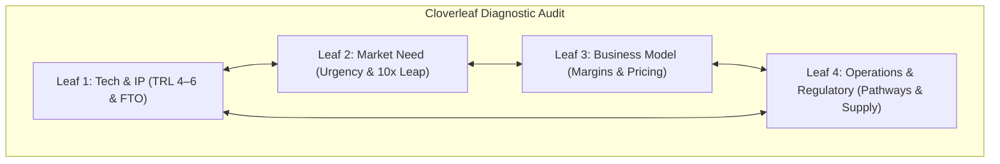

# [Technology Name / Innovation Project]

> **Executive Summary:** Concise 2–3 sentence overview of the innovation, why it matters today, the decisive technical or economic breakthrough, and the primary market opportunity.

---

## Innovation Metadata & Lifecycle Taxonomy

| Metadata Field | Project Specification |
|---|---|
| **Primary Innovation Stage** | Stage 1 (Discovery) / Stage 2 (Representation) / Stage 3 (Needs-Seeds) / Stage 4 (Architecture) / Stage 5 (Market & MVP) / Stage 6 (Capital) / Stage 7 (Scaling) |
| **Current TRL** | TRL 1–3 (Laboratory Proof-of-Concept) / TRL 4–6 (Simulated / Field Environment) / TRL 7–9 (Commercial Scale) |
| **Primary Mental Models Applied** | `Biological Evolution of Ideas`, `P-H Search Space`, `Functional Thinking`, `10x Imperative`, `The Firm as a Cash Engine` |
| **Governing Main Parameters of Value (MPVs)** | 1. [Metric 1, e.g., Speed <5s]   2. [Metric 2, e.g., Cost < \$10/unit] |
| **Target Customer Job-to-Be-Done** | [Core functional / operational goal customer seeks to accomplish] |
| **Research Date & Lead Investigator** | YYYY-MM-DD \| [Author / Research Team] |

---

## 1. Problem Space & Coordinate Representation (Stage 1 & 2)

- **Native Domain Representation:** How is this problem traditionally framed in its original academic or industrial field?
- **Roadblock / Impasse:** Why has conventional optimization or increased compute/funding failed to solve it?
- **Alternative P-H Coordinate Systems:**
  - *Perspective A (Imported Domain):* ...
  - *Applied Heuristic / Search Method:* ...
  - *Cognitive Advantage:* ...

---

## 2. Universal Functional Deconstruction (Stage 3)

- **Stripped Technology Description:** (Free of domain jargon and component brand names)
- **Subject-Action-Object (S-A-O) Triads:**
  1. `[Subject]` + `[Action Verb]` + `[Target Object]`
  2. `[Subject]` + `[Action Verb]` + `[Target Object]`
- **Cross-Industry Application Candidates:**
  | Adjacent Vertical | Existing Workaround | Why Our Seed Wins (10x Leap) |
  |---|---|---|
  | [Industry A] | ... | ... |
  | [Industry B] | ... | ... |

---

## 3. Customer Activity Chain & Friction Analysis (Stage 3)

- **Functional Friction:** Where does the current customer workflow physically fail or bottleneck?
- **Economic Friction:** What are the hidden time, labor, or scrap costs?
- **Emotional / Risk Friction:** What reputational liability or switching anxiety prevents customer adoption?

---

## 4. Business Architecture Design (Stage 4)

### Pillar I: Business Model
- **Value Creation Mechanism:** [Differentiation / Cost Advantage / Network Effects]
- **Value Capture (Monetization):** [Unit Margin / SaaS Subscription / Metered Usage / IP Licensing]
- **Target Contribution Margin:** [e.g., >75%]

### Pillar II: Operating Model (Delivery Engine)
- **Structure:** [Product Firm / Service Provider / Two-Sided Platform]
- **Core Capabilities Required:** [e.g., Regulatory clearance engineering, supply-chain orchestration]
- **Proprietary Strategic Assets:** [e.g., Foundational patents, longitudinal datasets, manufacturing pilot line]
- **Alignment Verification:** Does the operating cost per unit allow the target contribution margin?

---

## 5. Market Assessment, Cloverleaf Audit & MVP Validation (Stage 5)

- **TRL Status & Operational Noise Stability:**
- **Freedom to Operate (FTO) Claims Clearance:**
- **Anticipated Incumbent Market Antibodies:**
- **100-Interview Discovery Synthesis:** (Key historical findings from ecosystem strangers)
- **Deep-Tech MVP Archetype Deployed:** [Conceptual / Simulated (Wizard of Oz) / Prototypical]
- **Disconfirming Evidence Invalidation Metric:** What specific empirical data kills the hypothesis?
- **Observed User Friction (Think-Aloud Protocol):**
- **Customer Economic Commitments Extracted:** [Letters of Intent / Paid Pilots / Reservation Deposits]

---

## 6. Financial Architecture & Capital Strategy (Stage 6 & 7)

- **Cash Conversion Cycle (CCC):** $\text{DIO} + \text{DSO} - \text{DPO} = [\qquad]$ days.
- **Internal Cash Engine Levers:** (e.g., upfront prepaid contracts, milestone deposits).
- **Staged Milestone Financing Ladder:**
  | Milestone Round | Capital Required | Discriminating Milestone Unlocked | Valuation Step-Up Target |
  |---|---|---|---|
  | **Pre-Seed / Non-Dilutive** | \$250k (SBIR Phase I) | TRL 4 component validation | Foundation set |
  | **Seed Round** | \$1.5M (Angel / Seed VC) | Wizard of Oz pilot with 3 paid LOIs | \$8M–\$10M cap |
  | **Series A** | \$6.0M (Institutional Syndicate) | Regulatory clearance & commercial scale | \$25M–\$35M post |

---

## 7. Key References, Glossaries & Artifacts

- **Primary Source Notes:** `[Source Note Title 1]`, `[Source Note Title 2]`
- **Glossary Cross-References:** [[Main Parameters of Value]], [[Freedom to Operate]], [[The Firm as a Cash Engine]]
