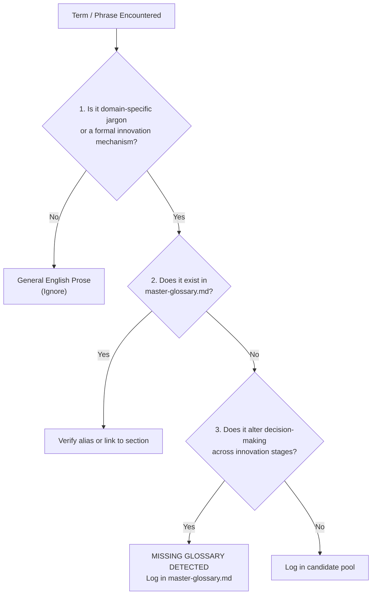

# Glossary Auditing & Missing-Term Detection Guide

> **Diátaxis How-To Guide:** How to systematically detect terminology gaps, audit conceptual coverage, and maintain semantic integrity across the innovation documentation knowledge base.

---

## 1. Purpose & Core Philosophy

In multi-stage technology innovation and commercialization research, ambiguous or unindexed terminology leads to **cognitive misalignment** between technical founders, investors, and operators.

This guide provides an operational protocol for:
1. **Detecting Missing Glossaries:** Systematically identifying when a research document or raw note introduces a new concept that lacks a canonical definition.
2. **Preventing Conceptual Drift:** Ensuring terms like *MVP*, *Value Capture*, or *De-Risking* retain their precise mathematical and structural definitions across documents.
3. **Automated Auditing:** Executing the CLI coverage script to detect terminology coverage, cross-references, and unindexed candidate terms in seconds.

---

## 2. The Glossary Entry Standard (Schema)

Every glossary term added to [`master-glossary.md`](./master-glossary.md) must follow this standardized Markdown schema:

```markdown
### `Term Name` (Optional Acronym)
- **Aliases:** `Alternative Name 1`, `Alternative Name 2`
- **Definition:** Clear, concise 2–3 sentence operational definition explaining what the concept is and why it matters.
- **Formula / Axiom (if applicable):** Mathematical relationship, ratio, or formal representation (LaTeX syntax).
- **Originators / Foundational Authors:** Key academic or industry figures who formalized the concept.
- **Innovation Stage:** Stage 1 through Stage 6 where the term is most actively applied.
- **Common Trap / Anti-Pattern:** The specific mistake founders make regarding this concept.
- **Related Terms:** Cross-links to other defined terms (e.g., Term Name 1, Term Name 2).
```

---

## 3. How to Detect Missing Glossaries Manually

When reviewing a new research whitepaper, note, or case study, apply the **3-Question Heuristic Filter**:



### The 3-Question Heuristic:
1. **Domain Specificity Test:** Is the phrase a foundational concept in technology commercialization (e.g., *Negative Working Capital*, *Freedom to Operate*, *Wizard of Oz MVP*) rather than generic business vocabulary?
2. **Registry Check:** Search [`master-glossary.md`](./master-glossary.md) for the term or its common aliases.
3. **Decision Impact Test:** If a founder or researcher misunderstands this term, will it cause an operational failure, capital misallocation, or representational bias? If yes, it is an **essential glossary term**.

---

## 4. Automated Detection via CLI Tool

The repository includes a dedicated Python utility located at [`check-glossary-coverage.py`](./check-glossary-coverage.py).

### How to Run the Scanner

```bash
# Scan the innovation research repository
python3 glossaries/check-glossary-coverage.py

# Scan a specific directory (e.g., new research whitepapers or external notes)
python3 glossaries/check-glossary-coverage.py --scan-dir research/

# Scan external local raw notes
python3 glossaries/check-glossary-coverage.py --scan-dir /path/to/notes
```

### Understanding the Output Report

1. **Validated Glossary Cross-References:** Total number of indexed terms and aliases recognized across documentation.
2. **Unindexed Terms & Gaps (High Priority):**
   - Shows concepts referenced across notes that lack a canonical entry or alias in `master-glossary.md`.
   - Action: Add the missing entry or add the target phrase to an existing entry's `- **Aliases:**` list.
3. **Frequent Candidate Terms (Emerging Concepts):**
   - Extracts recurring bolded phrases (`**Term**`) that appear across multiple notes but are not yet registered.
   - Action: Review these candidates to decide whether they should be elevated to formal glossary entries.

---

## 5. Workflow for Adding a Missing Glossary

When a gap is identified:

1. **Locate the Target Section:** Open [`master-glossary.md`](./master-glossary.md) and scroll to the appropriate Innovation Stage section (Stage 1 through Stage 6, or Core Foundations).
2. **Draft the Schema Block:** Populate the entry according to Section 2 above.
3. **Register Aliases:** If the term was referenced by alternative names or previous note titles (e.g., `Seeds - Needs Matching` vs `Accelerated Innovation`), include them in `- **Aliases:**`.
4. **Re-Run the Scanner:** Execute `python3 glossaries/check-glossary-coverage.py` to verify that the gap has dropped to zero.
5. **Cross-Link:** Update relevant stage documents in [`../stages/`](../stages/) to reference the newly documented term.
