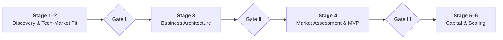
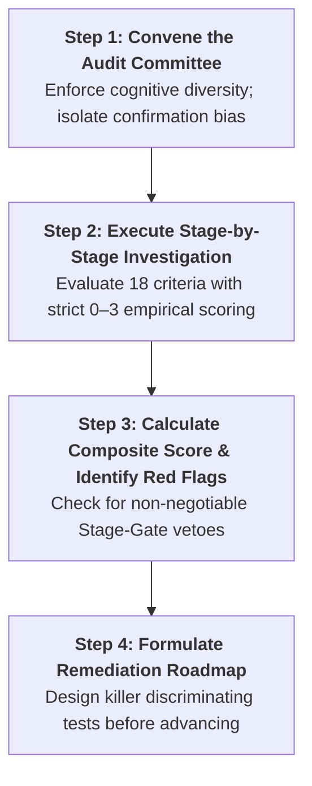
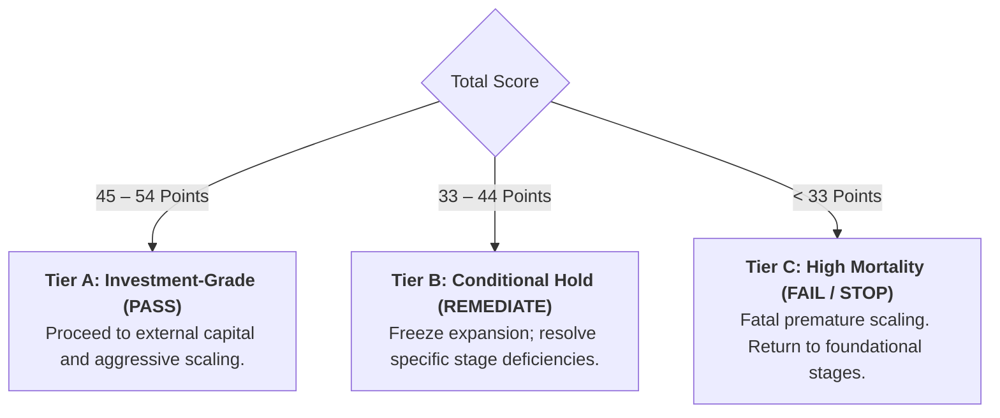

# How-To Guide: Conduct a Stage-Gate Innovation Project Audit

> **Diátaxis How-To Guide:** Step-by-step protocol for systematically auditing, scoring, and de-risking a technology commercialization project across the 6 stages of the innovation lifecycle before committing capital or scaling operations.

---

## 1. Overview, Prerequisites & Audit Objective

Venture failure rarely stems from flawed engineering; over 90% of failures trace back to **premature scaling**—advancing to fundraising, hiring, and mass sales before resolving existential foundational uncertainties in earlier stages.

This guide operationalizes a rigorous **Stage-Gate Venture Audit**. It provides the evaluation protocol, investigative questions, evidence thresholds, and scoring mechanics required to stress-test a breakthrough project from laboratory discovery to syndicate growth.



### Prerequisites & Required Dossier
Before initiating the audit, the lead investigator or founding team must compile an **Evidence Dossier** containing:
1. **Technical Proof:** Lab notebook excerpts, raw repeatability data across ambient stress parameters, and TRL assessment.
2. **IP Documentation:** Patent claims tree, provisional filings, and an independent preliminary Freedom-to-Operate (FTO) search.
3. **Customer Discovery Logs:** Unfiltered interview transcripts with at least 100 industry practitioners (strangers, not friendly acquaintances).
4. **Economic & Operating Models:** Business Architecture Canvas, Unit Economics breakdown (contribution margin per delivery), and Cash Engine working capital metrics.
5. **Cap Table & Legal Rights:** Current cap table, founder vesting schedules, and university Technology Transfer Office (TTO) term sheets or license agreements.

---

## 2. The 4-Step Audit Protocol



---

### Step 1: Convene the Audit Committee

To eliminate founder confirmation bias and academic wishful thinking, the audit cannot be conducted by the lead inventor alone.

1. **Form the Review Triad:**
   - **Technical Lead:** Explains physical mechanism, boundary conditions, and test fidelity.
   - **Commercial / Operating Lead:** Defends customer discovery logs, pricing models, and cash conversion cycle.
   - **External Skeptic / Devil’s Advocate:** An experienced outside operator, domain investor, or mentor whose explicit mandate is to invalidate venture assumptions.
2. **Ground Rules for Evidence:**
   - *No Credit for Good Intentions:* Verbal praise from prospects (*"That sounds like a great product"*) receives a score of **0**. Only past observed customer behavior, paid pilots, or binding conditional purchase orders count as evidence.
   - *Burden of Proof:* The venture is assumed to be failing until empirical data proves otherwise.

---

### Step 2: Execute Stage-by-Stage Investigation

Evaluate each of the 18 criteria across the 6 stages using the standardized **0–3 Scoring Rubric**:

| Score | Rating | Definition & Required Proof |
|:---:|---|---|
| **0** | **Unaddressed / Blind Spot** | Assumption completely unexamined; team relies on unverified intuition or has skipped the stage. |
| **1** | **Inadequate / High Risk** | Superficial validation; reliance on friendly surveys, theoretical models, or uncommitted verbal praise. |
| **2** | **Acceptable / Partially Validated** | Empirical data collected under controlled conditions; working prototypes or documented customer discovery patterns. |
| **3** | **Robust / Independently Verified** | Bulletproof empirical evidence; verified by arms-length third parties, binding contracts, or independent patent counsel. |

---

#### Stage 1: Scientific Discovery & The Seed (TRL 1–3)
*Inspect whether a genuine physical seed exists or if the project is mistaking laboratory noise for a breakthrough.*

* **1.1 Phenomenon Isolation:** Has the core physical/biological mechanism been definitively separated from artifacts of the experimental setup?
  - *Investigation:* Review raw data. What happens when sensor setups, reagents, or operator personnel change?
  - *Score 3 Standard:* Phenomenon holds across independently replicated, controlled test runs with published or audited test protocols.
* **1.2 Environmental Repeatability:** Does the effect reliably reproduce across variable ambient temperatures, humidity, and supply voltages?
  - *Investigation:* What are the extreme boundary failure points?
  - *Score 3 Standard:* Statistical bounds documented under stress conditions; clear operational parameter limits defined.
* **1.3 Broad Provisional IP:** Were the initial provisional patent claims drafted broadly without prematurely restricting the technology to a single vertical?
  - *Investigation:* Inspect claim 1. Does it claim the foundational mechanism, or does it narrow the application to a specific device?
  - *Score 3 Standard:* Broad genus claims filed prior to public disclosure; application independent.

---

#### Stage 2: Technology-Market Fit & Functional Alignment
*Verify that the team broke cognitive inertia, deconstructed the seed into universal functions, and synchronized capabilities with acute customer friction.*

* **2.1 Coordinate & Cognitive Diversity (P-H Search Space):** Did the team map at least 3 fundamentally distinct Problem-Heuristic (P-H) representations with cross-disciplinary outsiders before choosing an application?
  - *Investigation:* Review the P-H Search Space Canvas. Did the team explore non-obvious industries and include domain outsiders during framing?
  - *Score 3 Standard:* Formal matrix documenting ≥3 distinct problem coordinate spaces with clear evaluation rationales and cross-disciplinary input.
* **2.2 Universal Functional Deconstruction (S-A-O):** Has the technology been deconstructed into active Subject-Action-Object triads and queried across cross-industry patent databases?
  - *Investigation:* Can the founders articulate what the device physically does without domain jargon? Did they search for identical functions in adjacent industries?
  - *Score 3 Standard:* Complete S-A-O diagram mapping technical components to fundamental physical actions, with documented cross-industry patent queries.
* **2.3 Customer Activity Chain & Decisive MPVs:** Has the complete workflow of the end user been mapped across adjacent activities, validating an order-of-magnitude (10x) leap on the decisive buying metric?
  - *Investigation:* Review user workflow friction points. Benchmark against incumbent alternatives: is the advantage incremental (15%) or disruptive (10x)?
  - *Score 3 Standard:* Comprehensive activity chain mapping friction points across candidate personas, with quantitative data proving a 10x improvement along the #1 buying criterion.

---

#### Stage 3: Business Architecture & Model Alignment
*Ensure the value capture and delivery models do not cannibalize profit margins.*

* **3.1 Defensible Value Capture & Pricing Metric:** Is the monetization model aligned with the customer's internal budget authority?
  - *Investigation:* How will the customer pay? Does the purchase require standard operational budget (OPEX) or board-level capital expenditure (CAPEX)?
  - *Score 3 Standard:* Pricing model matches the user's value metric (e.g., usage-based, ARR, or per-scan fee) with validated willingness to pay.
* **3.2 Operating Structure Definition:** Has the venture explicitly chosen between a Product Firm, Service Provider, or Platform Matchmaker?
  - *Investigation:* What are the required core capabilities and assets? Are we accidentally operating as an expensive consulting firm?
  - *Score 3 Standard:* Operating model architecture documented with explicit boundaries on what the firm builds vs. outsources.
* **3.3 Architectural Alignment Stress Test:** Does the unit cost of delivering the solution support a >70% contribution margin?
  - *Investigation:* Calculate: $\text{Contribution Margin} = \frac{\text{Price} - \text{Direct Delivery Cost}}{\text{Price}}$. Does delivery require unscalable manual support?
  - *Score 3 Standard:* Unit economics model showing path to >70% gross margin at commercial production scale.

---

#### Stage 4: Market Assessment, Due Diligence & MVP Validation
*Confirm real-world market traction and freedom to operate.*

* **4.1 Cloverleaf Due Diligence & FTO Clearance:** Has an independent patent search confirmed zero blocking claims across the target market?
  - *Investigation:* Review formal legal Freedom-to-Operate opinion. Are there active competitor patents?
  - *Score 3 Standard:* Formal FTO search letter from qualified IP counsel confirming unencumbered path to commercialization.
* **4.2 The 100-Stranger Interview Funnel (The Mom Test):** Did the team interview ≥100 industry practitioners without pitching the solution?
  - *Investigation:* Inspect discovery interview notes. Did the interviewer ask about past behavior and actual budget spend, or did they pitch hypothetical features?
  - *Score 3 Standard:* Database of 100+ interviews with unaffiliated industry professionals validating urgent, unprompted pain.
* **4.3 Discriminating Deep-Tech MVP:** Has a lean prototype (Wizard of Oz, Simulated, or Benchtop) extracted an authentic commitment from customers?
  - *Investigation:* What did the customer have to risk to test the prototype (time, confidential data, or money)?
  - *Score 3 Standard:* Customers have committed non-dilutive pilot cash, signed binding Letters of Intent with performance terms, or provided advance purchase deposits.

---

#### Stage 5: Venture De-Risking & Capital Architecture
*Examine the financial engine and staging of capital.*

* **5.1 Working Capital Architecture & Cash Conversion Cycle:** Is the venture designed for compressed or Negative Working Capital?
  - *Investigation:* Review payment terms. Are customers paying on Net-60 credit terms (Lemonade Model 2), or paying upfront subscriptions/milestones (Model 3)?
  - *Score 3 Standard:* Contract structures secure upfront cash collections before production/service costs are incurred.
* **5.2 Killer Discriminating Experiment Execution:** Has the single assumption that could kill the business been decisively stress-tested?
  - *Investigation:* What was the cheapest, fastest experiment designed to invalidate the business? Did it pass?
  - *Score 3 Standard:* Completed discriminating experiment with unambiguous quantitative proof retiring the core existential risk.
* **5.3 Capital Taxonomy Discipline:** Has the venture sequenced non-dilutive capital before accepting institutional dilution?
  - *Investigation:* For US ventures, have SBIR/STTR grants been pursued? For non-US ventures, have regional innovation grants been explored?
  - *Score 3 Standard:* Capital strategy prioritizes non-dilutive grants and customer financing, reserving venture capital strictly for market scaling.

---

#### Stage 6: Accelerators, Spin-Offs & Syndicate Governance
*Verify legal, governance, and institutional syndication hygiene.*

* **6.1 Clean TTO Licensing & IP Assignment:** Is the core IP assigned from the university/institution without predatory royalties?
  - *Investigation:* Does the university license demand gross revenue royalties >5%, or hold golden-share board vetoes?
  - *Score 3 Standard:* Exclusive global commercial license with capped equity stake and standard milestone-based minimum royalties.
* **6.2 Cap Table Hygiene & Founder Vesting:** Do active, operating founders own voting control with standard 4-year vesting schedules?
  - *Investigation:* Review the capitalization table. Are there inactive co-founders with huge equity blocks?
  - *Score 3 Standard:* Clean cap table; all founders on 4-year vesting with 1-year cliff; sufficient unallocated employee option pool (10%–15%).
* **6.3 Syndicate Quality & Signaling Risk Mitigation:** Does the lead institutional investor have deep follow-on reserves?
  - *Investigation:* What is the fund's reserve ratio? What happens if the lead VC refuses to participate in the next round?
  - *Score 3 Standard:* High-reputation lead investor with committed follow-on reserves and co-investment syndicate partners.

---

### Step 3: Calculate the Composite Score & Check Red Flags

Add the points across all 18 items (Maximum Score: **54 Points**).



#### Non-Negotiable Hard Stop Red Flags
Regardless of the total numerical score, any of the following **instant red flags triggers an immediate Gate FAIL**:
1. **Unresolved FTO Landmine:** A valid, active competitor patent directly reads on your product claims (Stage 4 failure).
2. **Pitching Over Discovery:** Founder cannot produce transcripts of at least 30 stranger interviews conducted without pitching the solution (Stage 4 failure).
3. **Dead Cap Table:** More than 25% of equity is held by non-operating founders or university advisors with no vesting schedules (Stage 6 failure).
4. **Positive Working Capital Trap:** Growth requires carrying massive accounts receivable buffers without available debt/equity reserves (Stage 5 failure).

---

### Step 4: Formulate the Stage Remediation Roadmap

When a project fails a specific stage gate or falls into Tier B/C:
1. **Do Not Raise Capital:** Halt all investor roadshows and hiring plans. Raising venture capital into an un-derisked architecture accelerates bankruptcy.
2. **Isolate the Lowest-Scoring Gate:** Identify the earliest stage with a score $<2.0$ per item.
3. **Formulate Corrective Discriminating Experiments:**
   - *Example (Failed 4.2):* Stop software build. Mandate that the team conduct 50 phone calls with target buyers using the Mom Test within 10 days.
   - *Example (Failed 5.1):* Restructure standard enterprise sales contract to require a 50% upfront milestone deposit before kickoff.
4. **Re-Audit:** Re-convene the Audit Committee in 30 days to re-score the remediation deliverables before releasing gate clearance.

---

## 3. Printable Stage-Gate Audit Canvas (Operational Worksheet)

Copy and execute this worksheet directly during the formal stage-gate evaluation:

```markdown
# Stage-Gate Venture Audit Scorecard

**Project Name:** ________________________  
**Lead Investigator / Founder:** ________________________  
**Audit Date:** ______________   
**Reviewers:** ________________________  

### Stage 1: Scientific Discovery & The Seed (Max: 9)
- [ ] 1.1 Phenomenon Isolation: Fundamental mechanism isolated from laboratory artifacts. [Score 0–3: ___ ]
- [ ] 1.2 Repeatability: Effect verified across environmental stress parameters. [Score 0–3: ___ ]
- [ ] 1.3 Broad Provisional IP: Foundational claims filed before vertical restrictions. [Score 0–3: ___ ]
*Stage 1 Subtotal: [ ___ / 9 ]*

### Stage 2: Technology-Market Fit & Functional Alignment (Max: 9)
- [ ] 2.1 Coordinate & Cognitive Diversity: At least 3 distinct P-H mappings documented with cross-disciplinary input. [Score 0–3: ___ ]
- [ ] 2.2 Functional Deconstruction: Deconstructed into Subject-Action-Object (S-A-O) triads with cross-industry queries. [Score 0–3: ___ ]
- [ ] 2.3 Activity Chain & MPVs: Mapped end-to-end friction and validated 10x leap on decisive metric. [Score 0–3: ___ ]
*Stage 2 Subtotal: [ ___ / 9 ]*

### Stage 3: Business Architecture Design (Max: 9)
- [ ] 3.1 Value Capture: Pricing metric matches customer budget authority and value metric. [Score 0–3: ___ ]
- [ ] 3.2 Operating Model: Structure (Product/Service/Platform) & capabilities defined. [Score 0–3: ___ ]
- [ ] 3.3 Architectural Alignment: Unit economics prove path to >70% contribution margin. [Score 0–3: ___ ]
*Stage 3 Subtotal: [ ___ / 9 ]*

### Stage 4: Market Assessment & MVP Validation (Max: 9)
- [ ] 4.1 FTO & Due Diligence: Formal patent counsel opinion confirms zero blocking claims. [Score 0–3: ___ ]
- [ ] 4.2 100-Stranger Interviews: Validated urgent unprompted pain using the Mom Test. [Score 0–3: ___ ]
- [ ] 4.3 Discriminating MVP: Extracted binding financial or operational commitment. [Score 0–3: ___ ]
*Stage 4 Subtotal: [ ___ / 9 ]*

### Stage 5: Venture De-Risking & Capital Architecture (Max: 9)
- [ ] 5.1 Working Capital: Structured for negative or compressed Cash Conversion Cycle. [Score 0–3: ___ ]
- [ ] 5.2 Killer Experiment: Completed decisive test retiring fatal existential assumption. [Score 0–3: ___ ]
- [ ] 5.3 Capital Sequence: Non-dilutive public grants prioritized prior to dilutive VC. [Score 0–3: ___ ]
*Stage 5 Subtotal: [ ___ / 9 ]*

### Stage 6: Spin-Offs & Syndicate Governance (Max: 9)
- [ ] 6.1 Clean TTO Licensing: Global exclusive assignment without predatory gross royalties. [Score 0–3: ___ ]
- [ ] 6.2 Cap Table Hygiene: Operating founders hold control; 4-year vesting implemented. [Score 0–3: ___ ]
- [ ] 6.3 Syndicate Alignment: Lead VC has deep follow-on reserves, mitigating signaling risk. [Score 0–3: ___ ]
*Stage 6 Subtotal: [ ___ / 9 ]*

---

### Composite Audit Summary

| Stage Gate Section | Maximum Score | Actual Score | Gate Recommendation |
|---|:---:|:---:|:---:|
| **Discovery & Tech-Market Fit (Stages 1–2)** | 18 | [ ___ ] | [ Pass / Remediate ] |
| **Business Architecture (Stage 3)** | 9 | [ ___ ] | [ Pass / Remediate ] |
| **Market Assessment & MVP (Stage 4)** | 9 | [ ___ ] | [ Pass / Remediate ] |
| **Capital & Governance (Stages 5–6)** | 18 | [ ___ ] | [ Pass / Remediate ] |
| **TOTAL SCORE** | **54** | **[ ___ ]** | **FINAL TIER: [ ___ ]** |

**Remediation Action Items (if < 45 points):**
1. ____________________________________________________________________
2. ____________________________________________________________________
3. ____________________________________________________________________
```

---

## 4. Cross-References & Operational Toolkits

- **Stage Framework:** [The Innovation Lifecycle: 6 Stages of Lab-to-Market Translation](../stages/index.md)
- **Functional Deconstruction:** [How-To Guide: Deconstruct Technology Seeds into Universal Functions](./how-to-deconstruct-technology-seeds.md)
- **Problem Reframing:** [How-To Guide: Reframe Intractable Problems Using P-H Pairs](./how-to-reframe-stuck-problems.md)
- **Experiment Design:** [How-To Guide: Design Killer Discriminating Experiments for Deep Tech](./how-to-design-discriminating-experiments.md)
- **Business Architecture:** [How-To Guide: Audit Business & Operating Model Alignment](./how-to-audit-business-architecture.md)
- **Capital Taxonomy:** [Five Different Capital Types](../structures/five-different-capital-types.md)
- **Decision Canvases:** [Actionable Canvases & Diagnostic Worksheets](../structures/canvases-and-worksheets.md)
