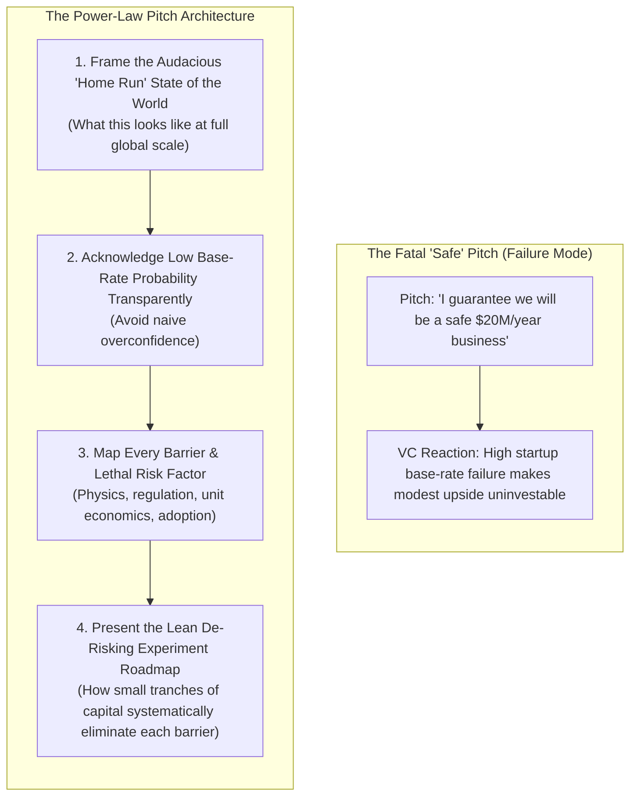
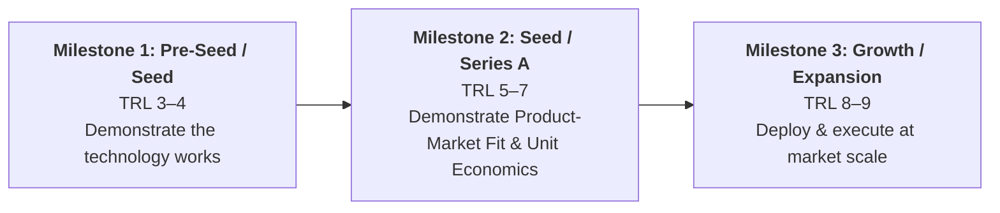
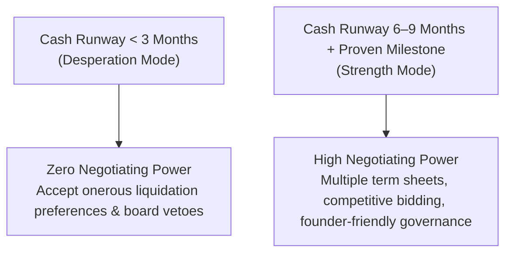
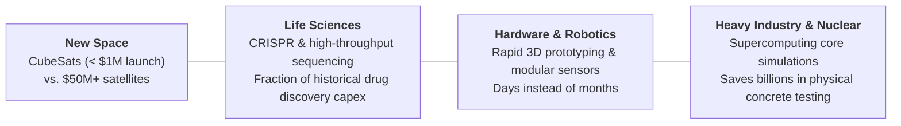

# How-To Guide: Pitch Investors, Align Counterparties & Structure Staged Financing

> **Diátaxis How-To Guide:** Practical operational instructions for pitching power-law investors, auditing counterparty incentives, calculating fully diluted equity, and synchronizing milestone de-risking with staged capital rounds.  
> *Synthesized from Harvard Business School entrepreneurial finance research (Prof. Ramana Nanda, Prof. Bill Sahlman, and Prof. Gary Pisano).*

---

## Prerequisites & Goal

- **Prerequisites:** A validated laboratory discovery or prototype (TRL 3+), preliminary customer pain point data, and a draft business model.
- **Goal:** Structure an investment pitch, cap table, and staged financing strategy that maximizes founder equity value, aligns counterparty incentives, and maintains negotiating leverage without succumbing to the capital abundance trap.

---

## Step 1: Architect the "Hits-Model" Venture Pitch

Venture capital operates on a **power-law hits model**: a tiny fraction of investments generate virtually all fund returns. VCs cannot sustain a portfolio by backing "safe" businesses with capped upside.

### The Pitch Construction Protocol

1. **Articulate the Home Run:** Present the macro-scale vision where your technology redefines the industry ($500M+ enterprise value), regardless of how low the initial probability is.
2. **Catalog Existential Failure Modes:** Show investors you have cataloged every reason this venture could fail (manufacturing yield, channel gatekeepers, customer switching costs).
3. **Show Capital-Efficient De-Risking:** Prove how the requested capital will be deployed to decisively test and eliminate those specific failure modes one by one.

---

## Step 2: Audit Counterparty Incentives & Structural Alignment

Founders do not need to be corporate lawyers, but they must conduct a forensic analysis of the investor's institutional incentives before accepting term sheets.

| Diagnostic Question | Operational Investigation | Red Flag / Structural Friction |
| --- | --- | --- |
| **1. Who is the counterparty beholden to?** | Review their fund structure: Are they a 10-year closed-end LP fund, a corporate VC (CVC), a family office, or an angel syndicate? | A 10-year closed-end fund investing in a deep-tech venture that requires 12 years of physical Capex before exit. |
| **2. Where and how do they make their money?** | Does the firm live on 2% management fees (asset gathering) or 20–30% carried interest on outsized exits? | Early pressure to flip the company for a small acquisition so the GP can secure immediate carry to raise Fund II. |
| **3. Where will points of friction lie?** | When will they need an exit? What governance vetoes do they demand over follow-on rounds or founder firing? | Demands for blocking rights over subsequent equity financing or aggressive liquidation preference multiples ($>1\times$). |
| **4. Are we genuinely aligned?** | Does the investor share your multi-stage horizon and technological tolerance? | Misalignment between software VC expectations (18-month sprints) and physical science validation cycles. |

---

## Step 3: Synchronize the Technology Path with the 3 Financing Inflections

Never raise capital to "run the business indefinitely." Raise capital specifically to purchase the empirical data that unlocks the next valuation step and investor tier.

### 1. Milestone 1 (Pre-Seed / Early Seed: \$250K – \$2M)

- **Primary Hypothesis:** Does the underlying science/technology actually work outside the university benchtop?
- **Core Deliverables:** Functional proof-of-concept, verified physical/chemical parameters, preliminary freedom-to-operate (FTO) review.
- **Investor Target:** Angels, university venture funds, specialized pre-seed micro-VCs, non-dilutive SBIR/STTR grants.

### 2. Milestone 2 (Seed / Series A: \$2M – \$10M)

- **Primary Hypothesis:** Do customers have a compelling willingness to pay that produces viable unit economics?
- **Core Deliverables:** Signed Letters of Intent (LOIs), paid pilot contracts, churn data, gross contribution margin calculations.
- **Investor Target:** Early-stage institutional venture funds.

### 3. Milestone 3 (Expansion / Series B+: \$10M – \$50M+)

- **Primary Hypothesis:** Can the company dominate the category through scaled manufacturing, enterprise sales, and distribution?
- **Core Deliverables:** Repeatable sales playbooks, working capital optimization, market share leadership.
- **Investor Target:** Growth equity, multi-stage institutional syndicates, strategic corporate partners.

---

## Step 4: Calculate Equity on a Fully Diluted Basis & Apply the Pie Axiom

### 1. The Share Count Trap vs. Fully Diluted Percentage

Absolute share numbers are arbitrary arithmetic illusions:

- Holding $1,000,000$ shares out of $2,000,000$ total shares = **50% ownership**.
- Holding $1,000,000$ shares out of $10,000,000,000$ total shares = **0.01% ownership**.

Always evaluate ownership on a **Fully Diluted Equity** basis, incorporating:
$$\text{Fully Diluted Shares} = \text{Common Shares} + \text{Preferred Shares} + \text{Unexercised Employee Options} + \text{Warrants} + \text{Convertible Notes/SAFEs}$$

### 2. Bill Sahlman's Maximizing Ownership Value Rule

Never optimize solely to minimize percentage dilution. Maximize the **absolute terminal value** of your equity:

$$\text{Founder Wealth} = \text{Ownership Percentage (\%)} \times \text{Terminal Enterprise Value (\$)}$$

> **The Sahlman Pie Axiom (Prof. Bill Sahlman, HBS):**  
> *"Who you take money from is almost or if not more important than the terms. A smaller piece of a much larger pie is worth vastly more than a large piece of a microscopic pie."*

If Investor A takes 25% equity but offers zero strategic support, while Investor B takes 30% but connects you to anchor customers, recruits key technical executives, and secures follow-on syndicates—Investor B dramatically expands the total pie, yielding a higher financial and operational return for founders.

---

## Step 5: Master the Negotiation Leverage & Runway Paradox

The venture financing paradox:

- **Rule A:** Raise as little capital as possible as late as possible to prevent premature dilution.
- **Rule B:** Fundraising while running out of cash destroys negotiating leverage, forcing catastrophic term sheets or fire-sale liquidation.

### The Leverage Preservation Protocol

1. **Target 18–24 Months of Runway:** Budget capital to achieve the target milestone in 12 months, leaving 6–9 months of cash cushion.
2. **Initiate Next Round at Milestone Peak:** Begin discussions with the next tier of investors immediately upon hitting the milestone, while 6+ months of cash remain in the bank.
3. **Demonstrate Next-Round Metric Alignment:** Show Series B investors that the Series A capital was directly used to produce the exact data (churn, retention, unit economics) that their investment committee mandates.

---

## Step 6: Enforce Capital Scarcity Discipline & Exploit Deep-Tech Cost Collapse

### 1. Beware the Capital Abundance Trap
>
> *"Necessity is the mother of invention. If capital comes too easily, teams fail to prove hypotheses in the leanest, scrappiest way possible."*  
> — Prof. Ramana Nanda

Abundant early capital induces fatal organizational habits: bloating headcounts, renting expensive lab real estate, and automating premature software backends before validating customer willingness to pay. Enforce a culture of proving hypotheses in the **scrappiest, cheapest way possible** (e.g., Wizard of Oz MVPs, rapid benchtop rigs) before scaling expenses.

### 2. Exploit the Order-of-Magnitude Cost Collapse in Tough Tech

While software startup costs collapsed in the 2000s (AWS, open source), physical science and deep tech are experiencing their own dramatic cost collapse:

Use these modular, low-cost experimental tools to de-risk physical ventures before approaching institutional capital.

### 3. Tap Patient Capital & Creative Syndicates

When physical or regulatory milestones exceed traditional 10-year closed-end fund horizons:

- Target **Mission-Aligned Family Offices** with perpetual or multi-decade horizons.
- Partner with **Patient Capital Coalitions** (such as the Prime Coalition in Boston for climate and clean energy, or Breakthrough Energy Ventures).
- Blend non-dilutive R&D grants (SBIR/STTR, Horizon Europe) with angel syndicates (AngelList, specialized deep-tech micro-funds) to bridge the early proof-of-concept phase.
