# The Mental Models Catalog: Principles & Paradigms of Innovation

> **A Reference Compendium of Foundational Mental Models, Governing Formulas, and Cognitive Representational Tools for Breakthrough Commercialization**

---

## Catalog Overview & Taxonomy

Mental models provide high-leverage cognitive lenses that compress complex operational environments into actionable decision rules. In technology entrepreneurship, deploying the correct mental model prevents years of wasted capital and misdirected research.

```mermaid
flowchart TD
    subgraph Search["Cognitive & Search Models"]
        M1["Biological Evolution of Ideas"]
        M2["P-H Landscape Search"]
        M3["Magic Square Coordinate Shift"]
        M4["Diversity Trumps Ability"]
    end

    subgraph Translation["Translation & Market Models"]
        M5["Universal Functional Thinking"]
        M6["Miles Value Ratio & MPVs"]
        M7["Jobs-to-Be-Done & ODI"]
        M8["Activity Chain Linkages"]
    end

    subgraph Architecture["Architecture & Strategy Models"]
        M9["Business Architecture Symbiosis"]
        M10["Operating Model Triad"]
        M11["The 10x Imperative & Antibodies"]
        M12["Contact Sport Tech Transfer"]
    end

    subgraph Financial["Financial & Governance Models"]
        M13["The Firm as a Cash Engine"]
        M14["Lemonade Stand Working Capital"]
        M15["Discriminating Experiment Staging"]
        M16["Capital Risk Asymmetry"]
        M17["VC Power Law & Fund Horizon"]
        M18["Co-Determination of Strategy & Financing"]
        M19["Sahlman Pie & Investor Value"]
        M20["3-Milestone Inflection Progression"]
        M21["Capital Scarcity Discipline"]
        M22["Deep-Tech Experiment Cost-Collapse"]
    end

    Search --> Translation --> Architecture --> Financial
```

---

## 1. Cognitive & Search Models

### Model 1: Biological Evolution as the Supreme Innovation Engine
- **Core Principle:** Breakthrough innovations do not emerge from divine individual inspiration or unrepeatable "aha" moments. They are generated through an evolutionary algorithm comprising variation, selection pressure, and iterative survival.
- **Governing Equation:**
  $$\text{Breakthrough Emergence} = \text{Variation} + \text{Selection Pressure} + \text{Systematic Iteration}$$
- **Originator:** Dr. Noubar Afeyan (Flagship Pioneering, Moderna).
- **When to Apply:** At venture inception and early exploratory phases when mapping new scientific categories.
- **Boundary / Failure Mode:** Applying selection pressure too early (e.g., forcing immediate revenue on early scientific prototypes) kills transformative variation before it can stabilize.
- **Canonical Case:** Moderna's mRNA platform—developed through hundreds of formulations and iterative chemical adjustments rather than a single dramatic pivot.

---

### Model 2: Perspective-Heuristic Landscape Search
- **Core Principle:** Commercialization is a search process across high-dimensional rugged fitness landscapes. A problem solver requires two tools: a **Perspective** (an internal coordinate system or representational frame) and a **Heuristic** (a navigational search rule applied within that frame).
- **Governing Equation:**
  $$\text{Problem Difficulty} = f(\text{Perspective}, \text{Heuristic})$$
- **Originator:** Prof. Karim Lakhani (Harvard Business School), Herbert Simon (Bounded Rationality).
- **When to Apply:** Whenever an engineering, scientific, or commercialization team hits an intractable roadblock.
- **The Problem Solver's Credo:** *"I am not failing because I am not working hard enough. I am failing because I haven't imported the right coordinate system yet."*
- **Canonical Case:** 3D printing (Emanuel Sachs, MIT 1989)—licensed to four independent companies, each applying a distinct P-H pair (desktop architectural models vs. controlled drug release kinetics vs. foundry casting vs. ceramic emission filters).

---

### Model 3: The Magic Square Coordinate Transformation
- **Core Principle:** Any problem that appears computationally exhausting in its native presentation can often be converted into an effortless, automatic solution by transforming the coordinate system.
- **The Herbert Simon Proof:**
  - Game: Pick numbers 1 through 9. First player to collect 3 numbers summing to 15 wins.
  - Perspective 1 (Arithmetic): High cognitive load, combinatorial permutation tracking, frequent errors under pressure.
  - Perspective 2 (3×3 Magic Square): Numbers arranged in a grid where every row, column, and diagonal equals 15. The game is mathematically isomorphic to **Tic-Tac-Toe**. The heuristic becomes instant visual recognition.
- **When to Apply:** When optimizing algorithms, re-segmenting markets, or structuring complex multiparty incentive contracts.

---

### Model 4: Diversity Trumps Ability (The Scott Page Theorem)
- **Core Principle:** On complex problem landscapes, a cognitively diverse group of problem solvers consistently outperforms a homogeneous group of high-ability domain experts.
- **Mechanism:** High-ability specialists within a single discipline often share the exact same perspective and get trapped in identical local optima. Outsiders introduce orthogonal coordinate systems that reveal immediate paths out of dead ends.
- **Operational Rule:** Separate the cognitive division of labor: use **non-experts** to generate expansive "unreasonable" variation; use **domain experts** to apply forensic selection pressure on physical limits.
- **Canonical Case:** NASA solar flare prediction (solved by Bruce Cragin, a retired cell phone radio engineer who framed space plasma physics through radio wave transmission).

---

## 2. Translation & Market Models

### Model 5: Universal Functional Thinking (Deconstruction)
- **Core Principle:** *Function is the goal; technology is merely a means.* Customers never purchase a technology for what it *is*; they purchase it exclusively for what it *does*.
- **The Axiom:** Strip away proprietary components and domain jargon into elementary physical actions (Active Verb + Target Object). A water filter is not a cylindrical plastic cartridge; it is a mechanism that **stops impurities**.
- **Originator:** Dr. Sam Kogan (Gen5 Group).
- **When to Apply:** When attempting to identify new commercial applications for a laboratory discovery beyond its original intended market.
- **Canonical Case:** Converting champagne degassing fluid dynamics into a \$65 vibration solution for micro-bubbles in semiconductor wafer manufacturing (\$3M chemical fix avoided).

---

### Model 6: The Miles Value Ratio & Main Parameters of Value (MPV)
- **Core Principle:** Customers make purchase decisions based on a ruthless calculation of value defined by Larry Miles (Value Engineering, 1940s):
  $$\text{Value} = \frac{\text{Perceived Utility / Performance}}{\text{Total Cost of Acquisition and Ownership}}$$
- **Operational Rule:** Innovators cannot optimize every variable. They must identify the **1–2 Main Parameters of Value (MPVs)** that govern customer purchasing decisions and ensure their solution offers an indisputable advantage along those decisive vectors.
- **Canonical Case:** Crest White Strips—succeeded not by maximizing whitening efficacy, but by winning on the decisive MPV of **at-home consumer convenience**.

---

### Model 7: Jobs-to-Be-Done (JTBD) & Outcomes-Driven Innovation (ODI)
- **Core Principle:** Customers don't buy products; they "hire" solutions to make progress against a specific **job-to-be-done**. While technologies and products change rapidly, the underlying job remains remarkably stable over decades.
- **The Maxim:** *"People don't want a quarter-inch drill bit. They want a quarter-inch hole."* — Theodore Levitt.
- **Operational Formula (ODI Outcome Metric):**
  $$\text{Desired Outcome} = \text{Direction} + \text{Unit of Measure} + \text{Object of Control} + \text{Operational Context}$$
- **When to Apply:** When structuring customer discovery interviews and drafting product requirement documents.

---

### Model 8: The Customer Activity Chain (Linkages-Driven Innovation)
- **Core Principle:** Customer friction is rarely confined to the point of product usage. True commercialization opportunity lies in mapping the end-to-end operational **activity chain** that customers traverse before, during, and after using a product.
- **The Chain:** Search → Negotiate → Purchase → Install → Operate → Maintain → Dispose.
- **Diagnostic Axes:** Evaluate friction across four distinct dimensions at every link:
  1. Functional (task difficulty)
  2. Economic (time and financial costs)
  3. Informational (cognitive overload and missing data)
  4. Emotional (stress, reputational anxiety, uncertainty)
- **Originator:** Prof. Vish Krishnan (UC San Diego).

---

## 3. Architecture & Strategy Models

### Model 9: Business Architecture Symbiosis
- **Core Principle:** A breakthrough technology with a validated customer need will still fail if its business architecture is incomplete or misaligned.
- **Governing Equation:**
  $$\text{Business Architecture} = \underbrace{\text{Business Model}}_{\text{Value Creation and Capture}} + \underbrace{\text{Operating Model}}_{\text{Value Delivery: Structure, Capabilities, Assets}}$$
- **The Xerox PARC Lesson:** Xerox PARC invented the graphical user interface, the mouse, Ethernet, and laser printing, but failed commercially because they lacked the business architecture that Apple and Microsoft built to monetize and deliver those capabilities.

---

### Model 10: The Operating Model Triad
- **Core Principle:** The operating engine required to deliver a value proposition consists of three tightly coupled components:
  $$\text{Operating Model} = \text{Structure} + \text{Capabilities} + \text{Assets}$$
- **Components:**
  - **Structure:** The organizational form (Product firm vs Service firm vs Two-sided platform).
  - **Capabilities:** Distinctive organizational proficiencies (e.g., FDA regulatory engineering, high-yield manufacturing).
  - **Assets:** Proprietary physical, digital, and intellectual property (e.g., patent portfolios, longitudinal clinical data).
- **Alignment Directive:** The operating model must directly reflect the promises made in the business model. Low-cost pricing cannot be delivered by high-touch bespoke service structures.

---

### Model 11: The 10x Imperative & Market Antibody Dynamics
- **Core Principle:** Established markets behave like biological immune systems: when an invasive new technology enters, incumbents and customers respond with aggressive **market antibodies** (switching costs, distributor exclusivity, patent thickets, regulatory roadblocks).
- **The Rule:** An incremental improvement (15–20% faster or cheaper) will be crushed by incumbent friction. A new entrant must offer an **order-of-magnitude (10x) performance or cost leap** along at least one critical MPV to justify customer adoption and overcome inertia.

---

### Model 12: Commercialization as a "Contact Sport"
- **Core Principle:** Technology commercialization is not a linear **relay race** where scientists run their leg in the lab, file a patent, and toss the baton over the wall to corporate licensees or business managers.
- **The Contact Sport Model:** Successful commercialization requires continuous, closed-loop co-development between researchers, entrepreneurs, and target customers from day one, sharing risks and iterating technical specifications based on immediate market reality.
- **Originator:** Prof. Vish Krishnan.

---

## 4. Financial & Governance Models

### Model 13: The Firm as a Cash Transformation Engine
- **Core Principle:** A business enterprise is fundamentally a transformation engine of liquid cash:
  $$\text{Cash} \xrightarrow{\quad\text{Build/Buy}\quad} \text{Operating Assets} \xrightarrow{\quad\text{Deliver/Sell}\quad} \text{Cash} + \Delta\text{Cash}$$
- **The Dual Mandate:**
  1. Maximize margin generated per cycle ($\Delta\text{Cash}$).
  2. Minimize the volume of capital trapped in intermediate operating assets (inventory, receivables, idle capacity).
- **Originator:** Prof. Ramana Nanda (Harvard Business School).

---

### Model 14: The Lemonade Stand Working Capital Model
- **Core Principle:** Business model payment terms dictate external capital requirements independent of accounting profitability:
  - **Model 1 (Cash-on-Delivery):** Requires small upfront float (\$100).
  - **Model 2 (Net-30 Invoice / Receivables):** Traps substantial cash in accounts receivable, requiring \$3,000 in working capital debt/equity to survive rapid growth.
  - **Model 3 (Negative Working Capital / Advance Customer Financing):** Customers pre-pay before inventory is purchased (\$0 external financing needed).
- **Lesson:** Growing companies routinely go bankrupt while reporting high accounting profits because cash is trapped in working capital assets.

---

### Model 15: Discriminating Experiments & Hypothesis-Driven Staging
- **Core Principle:** Deep-tech ventures cannot afford to burn capital indiscriminately. Capital allocation must be organized around **discriminating experiments** that maximize validated learning per dollar spent.
- **The Metric:**
  $$\text{Experiment Efficiency} = \frac{\Delta\text{Uncertainty Resolved}}{\text{Capital Burned} \times \text{Time Elapsed}}$$
- **Rule:** Run the cheapest test that could decisively invalidate your core assumption before investing in secondary engineering tasks.

---

### Model 16: Debt vs. Equity Risk-Return Asymmetry
- **Core Principle:** Debt and equity possess fundamentally divergent economic payoff structures:
  - **Debt:** Capped upside (principal + fixed interest), full downside exposure. Demands predictable cash flows, collateral, and liquidation value.
  - **Equity:** Uncapped upside participation, full downside exposure. Tolerates intangible assets, high failure rates, and long maturation horizons.
- **Implication:** Funding early exploratory science with debt is structurally impossible. Equity is the necessary instrument for exploring high-uncertainty technical frontiers.

---

### Model 17: The Power Law & VC Fund Horizon Tension
- **Core Principle:** Institutional venture capital is governed by the mathematical power law: 5% of portfolio investments generate over 80% of aggregate returns.
- **The Conflict:** Institutional VCs operate on a rigid **10-year fund lifecycle**. Deep-tech breakthroughs with 12–15 year physical or clinical maturation curves experience severe structural friction unless milestone de-risking matches fund horizons.

---

### Model 18: The Co-Determination of Strategy & Financing
- **Core Principle:** Business model decisions and financing strategy decisions are not separate sequential silos; they are tightly co-determined, reciprocal feedback loops:
  $$\text{Business Model} \iff \text{Cash Flow Timing/Profile} \iff \text{Financing Strategy \& Capital Counterparties}$$
- **Mechanism:** What product-market strategy you pursue shapes your cash burn and capital requirements, determining who is willing to fund you. In turn, the governance, fund lifecycle, and return thresholds of your chosen financiers impose hard boundaries on what product-market strategy the venture is permitted to execute.
- **Originator:** Prof. Ramana Nanda (Harvard Business School).

---

### Model 19: The Sahlman Pie & Investor Value Axiom
- **Core Principle:** In entrepreneurial finance, absolute ownership percentage is a misleading vanity metric; what matters is the terminal dollar value of the founder's equity stake:
  $$\text{Founder Terminal Wealth} = \text{Fully Diluted Ownership (\%)} \times \text{Terminal Enterprise Valuation (\$)}$$
- **The Axiom:** *"A smaller piece of a much larger pie is worth vastly more than a large piece of a microscopic pie. Who you take money from is almost or if not more important than the terms."*
- **Originator:** Prof. Bill Sahlman, Prof. Ramana Nanda (Harvard Business School).
- **Implication:** High-value investors who accelerate customer acquisition, recruit executive leadership, and anchor follow-on syndicates expand the total pie by multiples that easily offset modest incremental dilution.

---

### Model 20: The 3-Milestone Inflection Progression
- **Core Principle:** Technology commercialization does not advance through arbitrary financing labels (pre-seed, seed, Series A), but through three discrete empirical inflection points:
  1. **Milestone 1 (Technology Works):** Proof of physical feasibility and fundamental technical performance.
  2. **Milestone 2 (Product-Market Fit & Unit Economics):** Customer willingness to pay, verified commercial demand, and viable unit economics.
  3. **Milestone 3 (Scaled Deployment):** Category dominance, scalable operational delivery, and competitive moats.
- **Financing Rule:** Capital is raised in discrete tranches specifically to purchase the empirical data necessary to de-risk the venture to the exact threshold demanded by the *subsequent* round of investors.

---

### Model 21: The Capital Scarcity Discipline Hypothesis
- **Core Principle:** Capital scarcity is an essential operational discipline in early-stage innovation ("necessity is the mother of invention"). Abundant, frictionless capital often harms startups by removing the imperative to run lean, discriminating tests.
- **The Mechanism:** When capital is scarce, teams are forced to prove hypotheses in the cheapest, scrappiest way possible (e.g., Wizard of Oz simulations, paper MVPs, benchtop rigs). When capital is excessive, teams build bloated infrastructures and bypass true customer validation, precipitating catastrophic late-stage failure.
- **Originator:** Prof. Ramana Nanda (Harvard Business School).

---

### Model 22: The Deep-Tech Experimentation Cost-Collapse
- **Core Principle:** Just as cloud computing (AWS) and open-source software collapsed the cost of software experimentation in the 2000s, modular tools and computational simulation are now collapsing the cost of physical science experiments by orders of magnitude:
  - **New Space:** CubeSat miniaturization enables satellite launches for $< \$1\text{M}$ instead of $\$50\text{M}+$.
  - **Genomics & Life Sciences:** CRISPR and high-throughput sequencing allow early drug mechanism exploration at a fraction of historic costs.
  - **Nuclear & Heavy Physics:** Supercomputing multi-physics simulations replace multi-billion-dollar concrete reactor test containment structures, saving billions in exploratory R&D.
- **Strategic Impact:** Tough tech and clean tech ventures can now achieve early milestone de-risking using micro-capital before requiring mega-scale capital expenditure.

