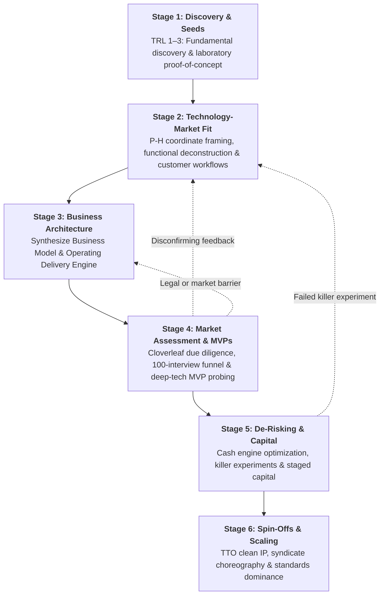

# The Innovation Lifecycle: 6 Stages of Lab-to-Market Translation

> **The Architectural Blueprint for Navigating Scientific Discovery, Technology-Market Fit, Business Modeling, and Venture Financing**  
> *Source: HarvardX LBTechX1 — Technology Entrepreneurship: Lab to Market*

---

## Executive Overview

Translating breakthrough science into an enduring, commercially viable enterprise is not a random guessing game. It is a disciplined, multi-stage engineering process characterized by **systematic uncertainty reduction**: extracting maximum validated market information for the minimum amount of sunk capital and time.

---

## Stage-Gate Progression Matrix

Each stage has rigorous **Entrance Criteria**, **Core Transformation Activities**, and **Exit Gate Deliverables** that must be achieved before committing significant capital to subsequent phases.

| Stage | Title | Core Objective | Primary Deliverable |
|:---:|---|---|---|
| [**1**](./stage-1-discovery-and-seeds.md) | **Discovery & Seeds** | Establish scientific proof-of-principle; isolate the raw technological seed. | Laboratory Proof-of-Concept (TRL 3); provisional patent filing. |
| [**2**](./stage-2-technology-market-fit.md) | **Technology-Market Fit** | Explore P-H search spaces, deconstruct seed to S-A-O functions, and synchronize with customer activity chains. | P-H Search Matrix; S-A-O Functional Decomposition; Customer Activity Chain map. |
| [**3**](./stage-3-business-architecture.md) | **Business Architecture** | Design value creation/capture mechanics and align with the operating delivery engine. | Business Architecture Alignment Canvas; Unit Economics model. |
| [**4**](./stage-4-market-assessment-and-mvp.md) | **Market Assessment & MVPs** | Multi-dimensional due diligence (Cloverleaf, FTO) and empirical testing using 100 interviews & deep-tech MVPs. | Cloverleaf Audit; FTO Legal Memo; 100-Interview Log; MVP Validation Report. |
| [**5**](./stage-5-venture-derisking-and-capital.md) | **De-Risking & Capital** | Architect negative working capital; execute killer discriminating tests; stage capital. | Cash Engine (CCC) Architecture; Discriminating Experiment Plan. |
| [**6**](./stage-6-spinoffs-and-scaling.md) | **Spin-Offs & Scaling** | Clean institutional IP licensing; assemble balanced VC syndicate; establish category standard. | TTO License Agreement; Clean Cap Table; Series A Syndicate Term Sheet. |

---

## Stage Navigation Guide

- [`stage-1-discovery-and-seeds.md`](./stage-1-discovery-and-seeds.md): How to evaluate laboratory capabilities and avoid the "hammer in search of a nail" trap.
- [`stage-2-technology-market-fit.md`](./stage-2-technology-market-fit.md): How to reframe problem representations via P-H pairs, deconstruct technology into universal S-A-O functions, and synchronize with customer activity chains to discover urgent Jobs-to-Be-Done.
- [`stage-3-business-architecture.md`](./stage-3-business-architecture.md): How to combine the Business Model with the Operating Model triad (Structure, Capabilities, Assets).
- [`stage-4-market-assessment-and-mvp.md`](./stage-4-market-assessment-and-mvp.md): How to conduct multi-dimensional market assessment (Cloverleaf, FTO) and test demand empirically via the 100-interview funnel and deep-tech MVPs.
- [`stage-5-venture-derisking-and-capital.md`](./stage-5-venture-derisking-and-capital.md): How to design the firm as a cash engine and execute hypothesis-driven staged financing.
- [`stage-6-spinoffs-and-scaling.md`](./stage-6-spinoffs-and-scaling.md): How to spin out from research institutions, survive accelerator sprints, and navigate VC syndicates.
