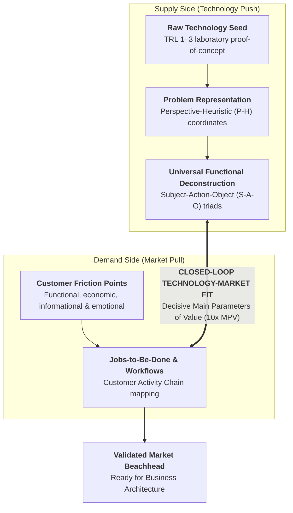

# Stage 2: Technology-Market Fit & Needs-Seeds Synchronization

> **Phase Focus:** Escaping Representational Inertia, Applying Perspective-Heuristic (P-H) Pairs, Universal Functional Deconstruction (Dr. Sam Kogan), Jobs-to-Be-Done, Customer Activity Chains (Prof. Vish Krishnan), and Closed-Loop Synchronization.

---

## 1. Stage Objective & Theoretical Foundation

Once a scientific discovery or technology seed is isolated in the laboratory, founders face a lethal dual hazard:

1. **Representational Inertia:** Staring at the technology exclusively through the narrow coordinate system of the academic discipline in which it was discovered.
2. **Unidirectional Push ("Clapping with One Hand"):** Believing that superior benchtop physics alone will compel customer adoption ("a hammer in search of a nail"), or conversely chasing superficial customer feature requests ("the faster horse trap").

As Prof. Vish Krishnan emphasizes, relying solely on technology push or market pull is like **"clapping with one hand."** Breakthrough commercialization requires **Technology-Market Fit**: a closed-loop synchronization engine where raw technology seeds are reframed through alternative cognitive search coordinates, deconstructed into universal physical functions, and systematically matched to validated friction in real-world customer workflows.

> **The Herbert Simon Principle**  
> *"Solving a problem simply means representing it so as to make the solution transparent."*  
> — Herbert Simon (Nobel Laureate, 1978)

---

## 2. Key Concepts & Definitions

### 2.1 Problem Representation & Cognitive Search

- **Perspective:** An internal coordinate system, mental model, or representational frame that dictates how a problem space is categorized, visualized, and decomposed.
- **Heuristic:** A search algorithm, rule of thumb, or navigational strategy applied to a problem space once it has been framed through a specific perspective to locate an optimal solution.
- **Perspective-Heuristic Pair (P-H Pair):** The coupled combination of a representation and a search rule:
  $$\text{Problem Difficulty} = f(\text{Perspective}, \text{Heuristic})$$
- **The Magic Square Analogy:** Herbert Simon demonstrated that the high-cognitive-load arithmetic game "Number 15" is mathematically isomorphic to Tic-Tac-Toe when mapped onto a 3×3 Magic Square. Transforming the coordinate frame eliminates mathematical calculation entirely and makes winning moves self-evident.
- **Cognitive Diversity:** Scott Page's *Diversity Trumps Ability Theorem* proves that a cognitively diverse group will consistently outperform a homogeneous group of high-ability domain experts because diverse problem-solvers bring disparate coordinate systems to the same landscape.

### 2.2 Functional Deconstruction & Needs Synchronization

- **Universal Functional Analysis (Functional Thinking):** A systematic methodology developed by Dr. Sam Kogan that strips away proprietary jargon, commercial trade names, and physical parts to define a technology strictly by what it *does* at an elementary physical level.
  - *Core Axiom:* **Function is the goal; technology is merely a means.**
- **Subject-Action-Object (S-A-O) Triad:** The semantic syntax of functional analysis: an active verb applied to a target object (e.g., *"separates hydrocarbon"*, *"stops impurities"*, *"transfers thermal energy"*).
- **Main Parameters of Value (MPV):** The 1–2 decisive quantifiable performance or economic metrics that govern customer purchase decisions in a specific application:
  $$\text{Value} = \frac{\text{Utility / Performance}}{\text{Total Cost of Acquisition \& Ownership}}$$
- **Jobs-to-Be-Done (JTBD):** The fundamental operational, functional, or emotional progress a customer seeks to achieve in a given circumstance (Theodore Levitt's maxim: *"People don't want a quarter-inch drill bit; they want a quarter-inch hole"*).
- **Customer Activity Chain (Linkages-Driven Innovation):** The sequential end-to-end operational journey a user executes: Search $\rightarrow$ Evaluate $\rightarrow$ Buy $\rightarrow$ Install $\rightarrow$ Operate $\rightarrow$ Maintain $\rightarrow$ Dispose. Diagnosing friction across every adjacent link uncovers where technological intervention delivers outsized value.

---

## 3. Core Transformation Activities

1. **Map Alternative Coordinate Systems:** For any technology seed, articulate at least 3–5 distinct P-H perspectives before locking into a commercial application (e.g., framing 3D printing as desktop documentation vs. pharmaceutical pill fabrication vs. foundry die tooling).
2. **Deconstruct the Seed into Universal Functions:** Eliminate all materials chemistry and domain-bound jargon. Express core capabilities strictly as active S-A-O triads.
3. **Execute Cross-Industry S-A-O Patent Queries:** Query patent databases across unrelated industries searching for identical elementary functions (e.g., cross-referencing fluid separation across municipal water, petrochemical refining, food/dairy processing, and pulp/paper).
4. **Map the Full Customer Activity Chain:** Interview practitioners in target verticals to map the complete operational chain, diagnosing functional, economic, informational, and emotional bottlenecks at every step.
5. **Establish Cognitive Diversity & Expert-Free Zones:** Create structured psychological environments where cross-disciplinary outsiders can challenge incumbent domain assumptions without reputational risk.
6. **Benchmark Decisive MPVs for a 10x Leap:** Establish baseline and target metrics to verify that the seed delivers an order-of-magnitude leap along the customer's #1 buying criterion.

---

## 4. Case Study: Via Separations (Shreya Dave, MIT)

- **The Failure of Unidirectional Push:** MIT researcher Shreya Dave developed a graphene oxide membrane for water desalination. However, market discovery revealed that electricity represented only a minor fraction of municipal water desalination costs; the advanced membrane saved almost nothing for plant operators.
- **The Functional Shift:** Stripping away domain jargon, she abstracted the technology to its universal function: *"mechanically separates molecules at ambient temperature."* Cross-industry analysis revealed that industrial thermal separations (boiling and distillation) consume **12% of all US industrial energy**.
- **The Accelerated Synchronization Loop:** Dave interviewed plant managers across 15 industries, identified pulp/paper and petrochemicals as acute pain points, quantified exact temperature and chemical tolerance requirements, and returned to the laboratory to calibrate membrane specifications to match operator workflows.

---

## 5. Governing Mental Models & Failure Modes

- **Mental Model:** *The Magic Square Principle* — when stuck, do not compute faster; step back and transform the coordinate system.
- **Mental Model:** *Universal Functional Thinking* — focus on the functional outcome demanded by the customer rather than the physical embodiment of the technology.
- **Cognitive Trap to Avoid:** *The Representational Trap (Functional Fixedness)* — viewing the breakthrough exclusively through the historical academic department in which it was conceived.
- **Cognitive Trap to Avoid:** *The "Hammer in Search of a Nail"* — technical founders falling in love with benchtop elegance and demanding the market adapt to their product.
- **Cognitive Trap to Avoid:** *The Faster Horse Trap* — asking customers what features they want rather than discovering their underlying Jobs-to-Be-Done.
- **Cognitive Trap to Avoid:** *The Late-Joiner Trap* — when a newcomer introduces a compelling alternative perspective mid-stream, apply the *Structured Challenge Protocol* rather than engaging in defensive factional debates.

---

## 6. Stage Gate 2: Exit Deliverables

Before advancing to [**Stage 3: Business Architecture Design & Model Alignment**](./stage-3-business-architecture.md), the venture must possess:

- [ ] Documented **P-H Search Matrix** detailing at least 3 distinct market coordinate systems.
- [ ] Completed **Universal Functional Deconstruction Worksheet** containing 3–5 active S-A-O triads.
- [ ] Cross-domain analogy and patent query results mapping identical functions in adjacent industries.
- [ ] Completed **Customer Activity Chain Map** diagnosing operational friction across target verticals.
- [ ] Quantified **Main Parameters of Value (MPVs)** demonstrating an order-of-magnitude (10x) leap over incumbents.
- [ ] Validated urgent customer **Job-to-Be-Done** confirmed through practitioner discovery interviews.
