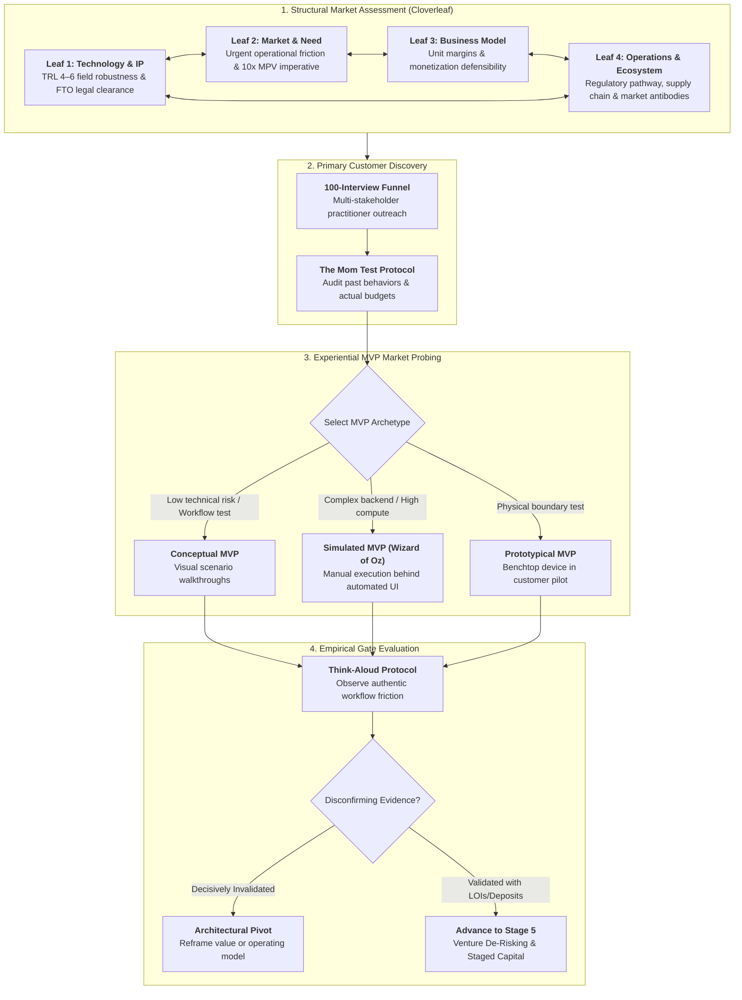
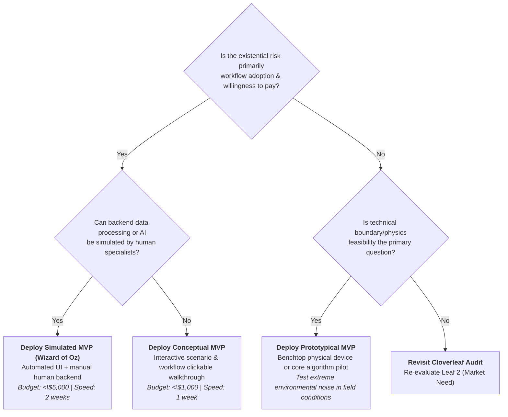

# Stage 4: Market Assessment, Due Diligence & MVP Validation

> **Phase Focus:** Multi-Dimensional Market Assessment, The Cloverleaf Framework, TRL 4–6 Milestones, Freedom to Operate (FTO), Incumbent Market Antibodies, The 100-Interview Discovery Funnel, Rob Fitzpatrick's Mom Test Principles, Deep-Tech MVP Archetypes, and Extracting Disconfirming Evidence.

---

## 1. Stage Objective & Theoretical Foundation

Translating laboratory discoveries and scientific breakthroughs into real-world commercial markets is characterized by severe attrition: estimated startup survival rates hover around **10–15%**. Ventures do not fail primarily because their underlying physics or chemistry is flawed; they fail because **market entry forces systemic friction upon entrenched ecosystems**. Markets and established incumbents respond to disruptive innovations much like a biological host responds to foreign pathogens: with **aggressive, antibody-driven immune reactions**.

At this critical inflection, traditional market research (such as market size reports, surveys, or pitch presentations) generates fatal false positives. Asking prospective buyers *"Would you buy a product that does X?"* costs them nothing to validate and produces empty verbal praise.

**Stage 4 unifies market assessment and MVP validation into a single uncertainty-reduction engine:**

1. **Structural Due Diligence (The Cloverleaf Model):** Stress-tests the venture across four interdependent vectors—Technology readiness, Market need, Business model defensibility, and Operational execution.
2. **Qualitative Market Discovery (The 100-Interview Funnel & The Mom Test):** Interrogates authentic past customer behaviors, operational workflows, and budget priorities without hypothetical pitching.
3. **Empirical Market Probing (Deep-Tech MVPs):** Deploys minimum viable experiential artifacts (Conceptual mockups, Simulated Wizard of Oz platforms, or Prototypical benchtop hardware) not as end-products, but as **instruments of market assessment** to reveal authentic operational friction, measure willingness to pay, and actively hunt for **disconfirming evidence**.

---

## 2. Key Concepts & Definitions

### 2.1 The Cloverleaf Model (Diagnostic Framework)

The **Cloverleaf Model** is a framework for determining whether a technology venture is ready to be taken to market. Developed by scholars **Heslop, McGregor, and Griffith**, it posits that science and technology commercialization cannot rely on technology readiness alone. A balanced market assessment requires evaluating four dimensions of equal maturity, each featuring a series of critical questions that help develop a comprehensive picture of venture readiness:

- **Technology Readiness (Leaf 1):** Technical proof, TRL 4–6 operational stability in real-world/noisy environments, and freedom to operate (FTO) patent boundaries.
- **Market Readiness (Leaf 2):** Quantifiable customer pain, purchasing authority, and decisive validation that the problem ranks in the customer's top 1–3 priorities.
- **Commercial Readiness (Leaf 3):** Sustainable business model defensibility, pricing power, unit economics with positive gross margins (>70%), and clear monetization architecture.
- **Team Readiness (Leaf 4):** Complementary leadership capabilities, operational execution capacity, aligned incentives, and balance across scientific and business disciplines.

### 2.2 Technology Readiness Levels (TRL 4–6 Sweet Spot)

- **TRL 4 (Lab Breadboard):** Basic components integrated and tested in laboratory conditions.
- **TRL 5 (Simulated Environment):** High-fidelity benchtop prototype tested in simulated operational conditions with environmental noise.
- **TRL 6 (Operational Prototype):** Subsystem or system model demonstrated in a relevant operational environment (e.g., pilot plant, clinic, testing grounds).
- *Market Assessment Rule:* Do not attempt commercial MVP pilots before reaching TRL 4/5; premature field exposure of unstable tech burns stakeholder trust permanently.

### 2.3 Freedom to Operate (FTO) & Market Antibodies

- **Freedom to Operate (FTO):** Rigorous legal due diligence confirming that manufacturing, selling, and operating the technology will not infringe valid third-party patent claims.
  - *Golden Rule:* Having a granted patent gives you the right to *exclude others*, but does **not** grant you the right to practice your own invention if an incumbent holds a dominant foundational patent.
- **Market Antibodies:** Entrenched incumbent defensive reactions: predatory bundling, supplier lock-in, regulatory lobbying, non-standard interfaces, and retaliatory patent litigation.
- **The 10x Imperative:** To overcome market antibodies and customer switching inertia, a new technological offering must deliver an **order-of-magnitude (10x)** improvement in cost, speed, efficiency, or yield along at least one decisive customer Main Parameter of Value (MPV).

### 2.4 The Customer Discovery Engine

- **The 100-Interview Funnel:** A non-negotiable discipline requiring founders to complete at least 100 in-depth qualitative discovery interviews with ecosystem practitioners (operators, purchasing managers, IT/security gatekeepers, clinical heads)—specifically strangers, never friends or family. Reaching 100 completed interviews typically requires contacting 500–1,000 prospects.
- **The Mom Test Principles (Rob Fitzpatrick):**
  1. *Talk about their life and past behaviors, not your idea.*
  2. *Ask about specific historical events* (*"When did this last happen? What did it cost you? What tools did you try?"*), never speculative futures (*"Would you buy a tool that...?"*).
  3. *Listen more than you speak; deflect compliments and probe for operational workarounds.*
- **Disconfirming Evidence:** Empirical observations, user data, or customer actions that refute the venture's core value proposition. Elite innovators actively seek disconfirming evidence early when burn rate is minimal.

### 2.5 The Deep-Tech MVP as a Market Assessment Instrument

An MVP in deep tech is not a scaled-down, buggy version of a product; it is **the smallest empirical artifact required to test an existential market assumption**:

1. **Conceptual MVP (Visual Scenarios):** High-fidelity architectural mockups, click-through wireframes, or day-in-the-life visual walkthroughs. Used to verify customer comprehension and prioritize workflow steps before writing software or machining parts.
2. **Simulated MVP (Wizard of Oz / Concierge):** The front-end user experience appears automated, while behind the scenes human experts manually perform the processing, algorithmic reasoning, or logistics in real time. Validates authentic demand, workflow integration, and willingness to pay *before* investing millions in backend automation.
3. **Prototypical MVP (Functional Benchtop Pilot):** The minimum physical device or specialized algorithm deployed into the customer's actual operational environment to test critical physical limits and operational tolerances.
4. **Think-Aloud Protocol:** Seating a target user in front of the MVP artifact and having them verbalize their live cognitive stream during operation. Hesitations > 3 seconds, confusion points, and workarounds reveal unarticulated market needs.

---

## 3. Core Transformation Activities

### Step 1: Execute the Internal-External Cloverleaf Audit

1. **Internal Team Audit:** Convene the founding team to catalogue all claims across the 4 leaves. Categorize every claim as either **Empirical Fact (Verified)** or **Unchecked Assumption**.
2. **Targeted External Inquiries:** Formulate each unverified assumption into a testable hypothesis directed at external market participants.

### Step 2: Conduct Formal FTO & Competitor Patent Mapping

1. Retain patent counsel to conduct a comprehensive claims clearance search across target jurisdictions (USPTO, EPO, WIPO).
2. Map competitor patent landscapes into white-space opportunities and identify potential blocking claims that require architectural workarounds or cross-licensing strategies.

### Step 3: Run the 100-Interview Discovery Sprint

1. Build a multi-stakeholder target list across the vertical: End-Users, Economic Buyers, Technical Integrators, and Regulatory/Compliance Officers.
2. Ban presentation decks from initial discovery calls; conduct open-ended interviews focused entirely on existing operational bottlenecks, current workaround expenses, and budget procurement timelines.

### Step 4: Deploy Deep-Tech MVPs to Probe Market Friction

1. Identify the venture's single most existential market hypothesis (e.g., *"Emergency physicians will adopt preliminary AI triage summaries without ordering full manual subspecialist re-reads"*).
2. Select the fastest, cheapest MVP archetype (Conceptual, Wizard of Oz, or Prototypical).
3. Deploy the artifact into a pilot cohort; observe users with the **Think-Aloud Protocol**.

### Step 5: Extract Objective Economic Commitments

1. Dismiss verbal validation, polite enthusiasm, and non-binding praise.
2. Demand authentic economic sacrifice to establish market signal:
   - **Tier 1 (Highest):** Non-refundable cash pilot deposit or upfront annual prepayment.
   - **Tier 2:** Signed commercial Letter of Intent (LOI) with explicit technical success milestones.
   - **Tier 3:** Commitment of proprietary customer data, facility access, and dedicated internal engineering hours.

---

## 4. Deep-Tech MVP Selection Decision Tree

---

## 5. Comprehensive Market Assessment Scorecard

| Assessment Dimension | Critical Due Diligence Inquiry | Passing Signal (Green) | Fatal Disconnect (Red Flag) |
| --- | --- | --- | --- |
| **Leaf 1: Technology & IP** | Does the technology perform under real-world operating noise? Is FTO clear? | TRL 5/6 operational validation; formal legal opinion confirming zero blocking claims. | Prototype fails outside lab; competitor holds dominant patent on fundamental mechanism. |
| **Leaf 2: Market Need & Urgency** | Is the customer pain urgent, prioritized, and backed by budget authority? | Problem ranks in customer's top 3 pain points; customer has dedicated budget allocated. | Problem is acknowledged but ranked #8 or #10 ("nice to have"); no budget allocated. |
| **Leaf 3: Business Model Viability** | Does the value capture model allow sustainable gross margins (>70%)? | Unit contribution margin verified; pricing captures a fair fraction of customer value created. | Operating delivery costs exceed price; unit economics require unproven billion-dollar scale. |
| **Leaf 4: Operations & Ecosystem** | Can the startup deliver the solution and survive incumbent market antibodies? | Clear regulatory predicate (FDA 510(k) / CE); modular supply chain partnerships. | Entrenched incumbent has exclusive vendor lock-in; 5-year regulatory clinical trial barrier. |
| **Empirical MVP Validation** | Did target users integrate the MVP into their daily operational workflow? | Low rejection rate (<10%); measurable time/cost savings; signed customer LOIs or pilot deposits. | >30% reject MVP outputs; users revert to legacy manual workarounds; refuse economic commitment. |

---

## 6. Stage Gate 4: Exit Deliverables

Before advancing to [**Stage 5: Venture De-Risking & Capital Architecture**](./stage-5-venture-derisking-and-capital.md), the venture must possess:

- [ ] **Completed Cloverleaf Diagnostic Scorecard:** Verified across all four leaves with zero unresolved fatal red flags.
- [ ] **Formal Freedom to Operate (FTO) Clearance:** Written legal opinion from patent counsel confirming product commercialization clearance.
- [ ] **100-Interview Funnel Log:** Structured qualitative notes documenting specific historical workflows, budgets, and pain rankings from 100 strangers.
- [ ] **Deep-Tech MVP Testing Synthesis:** Documented operational testing of a Conceptual, Wizard of Oz, or Prototypical MVP with Think-Aloud findings.
- [ ] **3–5 Non-Binding Customer Economic Commitments:** Signed Letters of Intent (LOIs), advance pilot deposits, or formal data-sharing agreements.
- [ ] **Validated 10x Performance Leap:** Empirical proof of an order-of-magnitude advantage along the customer's governing Main Parameter of Value (MPV).
