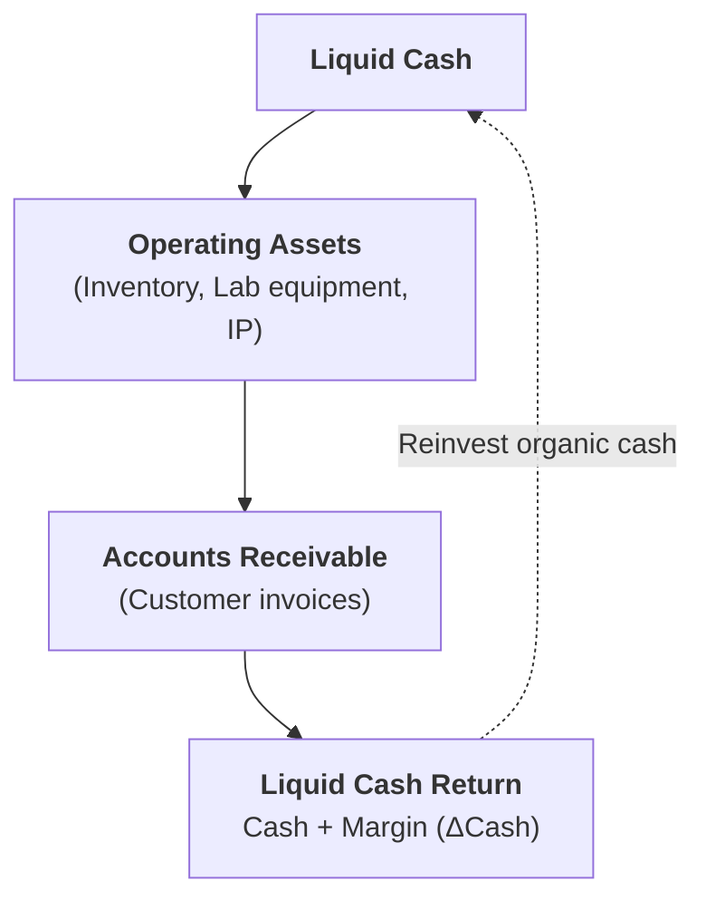
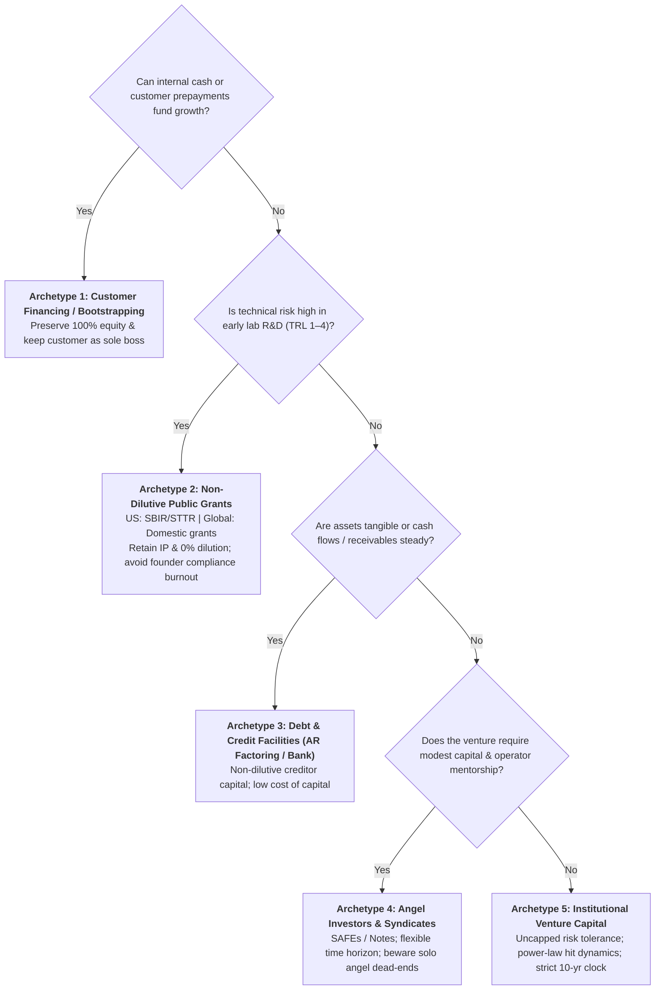

# Stage 5: Venture De-Risking & Capital Architecture

> **Phase Focus:** The Firm as a Cash Engine, Working Capital Optimization, Killer Discriminating Experiments, Staged Financing, and Capital Taxonomy.

---

## 1. Stage Objective & Theoretical Foundation

Raising external venture capital is not a badge of honor; institutional equity is the most expensive and restrictive capital instrument in existence. Stage 5 architects the venture's financial engine to minimize external dilution, compress the cash conversion cycle, and structure capital deployment around **hypothesis-driven discriminating milestones**.

> **The Entrepreneurial Finance Principle**  
> *"Raising external finance from a venture capital investor is really not necessarily a badge of honor. You do it when all other sources of capital are not feasible, because venture capital is very expensive."*  
> — Prof. Ramana Nanda (Harvard Business School)

---

## 2. Key Concepts & Definitions

- **The Firm as a Cash Engine:** A transformation machine that takes cash, turns that cash into assets, and turns those assets back into cash plus a return.
  - *Governing Directive:* Maximize margin ($\Delta\text{Cash}$) and minimize capital trapped in intermediate operational assets.
- **Cash Conversion Cycle (CCC):**
  $$\text{CCC} = \text{Days Inventory Outstanding (DIO)} + \text{Days Sales Outstanding (DSO)} - \text{Days Payables Outstanding (DPO)}$$
  - *Strategic Ideal:* **Negative Working Capital** (customers pay upfront subscriptions or advance deposits before vendor payables are due).
- **The Lemonade Stand Model:** Ramana Nanda's thought experiment proving how payment terms dictate financing requirements:
  - *Model 1 (Cash on Delivery):* Needs \$100 starting float.
  - *Model 2 (Net-30 Invoice / AR):* Needs \$3,000 in working capital debt/equity to survive growth.
  - *Model 3 (Negative Working Capital / Pre-orders):* Needs \$0 external capital; customer prepayments fund growth.
- **Discriminating Experiment (The Killer Experiment):** The cheapest, fastest empirical test designed to decisively invalidate a core venture hypothesis.
- **Staged Financing (Milestone Financing):** Capitalizing the company in discrete tranches tied to technical/regulatory milestones rather than funding the entire multi-year plan upfront.
- **Equity:** The value of the total shares of ownership in a company. Equity shares can be held through various types of shares, such as common stock (which is what is traded in public markets), preferred stock, and other share classes.
- **Debt vs. Equity Risk Asymmetry:**
  - *Debt:* Capped upside (principal + interest), full downside risk; requires predictable cash flow and liquid collateral.
  - *Equity:* Uncapped upside, full downside risk; tolerates binary outcomes and intangible assets.

---

## 3. Core Transformation Activities

1. **Architect for Negative Working Capital:** Structure customer contracts with upfront annual payments, advance milestone deposits, or hardware reservation fees to fund development organically.
2. **Formulate the Killer Discriminating Experiment:** Identify the single assumption that, if false, decisively kills the business; design an experiment to test it immediately before spending capital on secondary features.
3. **Sequence Non-Dilutive Public Capital (SBIR/STTR & Regional Programs):** Secure non-dilutive feasibility grants (such as US federal Phase I ~ \$250k and Phase II ~ \$1.5M SBIR/STTR grants for US-based ventures, or domestic public programs like Horizon Europe / Innovate UK / national R&D funds for non-US ventures) for exploratory TRL development while guarding against founder compliance distraction.
4. **Negotiate Balanced Capital Rights:** Distinguish between **Cash Flow Rights** (liquidation preferences, participating preferred shares) and **Control Rights** (board seats, veto thresholds over subsequent financings).

---

## 4. Capital Instrument Selection Matrix & Comprehensive Taxonomy

For the comprehensive operational framework—evaluating all 5 capital archetypes (bootstrapping, customer pre-financing, non-dilutive grants, debt/credit, and institutional VC), their dilution costs, governance/control concessions, risk tolerances, and venture stage suitability—consult:
> **[Five Different Capital Types](../structures/five-different-capital-types.md)**  
> *(Also cross-referenced in the [Multi-Criteria Decision Matrices](../structures/decision-matrices.md#2-capital-instrument-selection-matrix) and [Cash Engine & Working Capital Calculator](../structures/canvases-and-worksheets.md#worksheet-7-cash-engine--working-capital-calculator).)*

---

## 5. Stage Gate 5: Exit Deliverables

Before advancing to [**Stage 6: Accelerators, Spin-Offs & Syndicate Governance**](./stage-6-spinoffs-and-scaling.md), the venture must possess:
- [ ] Documented **Working Capital Architecture** with optimized CCC metrics and cash engine model.
- [ ] Completed **Killer Discriminating Experiment** proving the core technical/market hypothesis.
- [ ] Formulated **Capital Instrument Selection & Staged Financing Plan** adhering to the [Five Different Capital Types](../structures/five-different-capital-types.md).
- [ ] Term sheet review strategy balancing cash flow rights (liquidation preferences) with protective control provisions (board seats, vetoes, and down-round protections).
