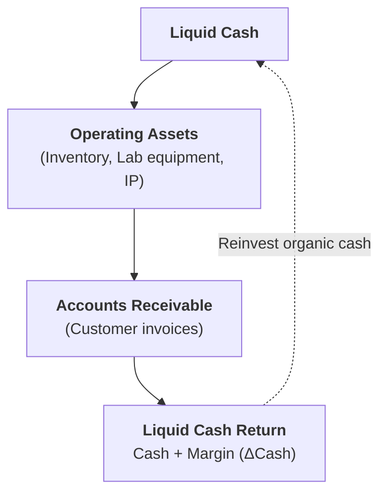
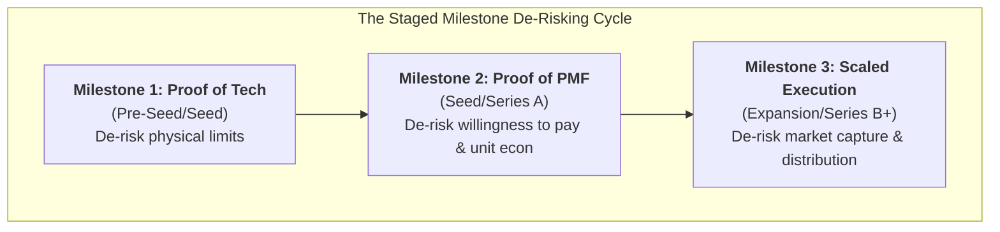
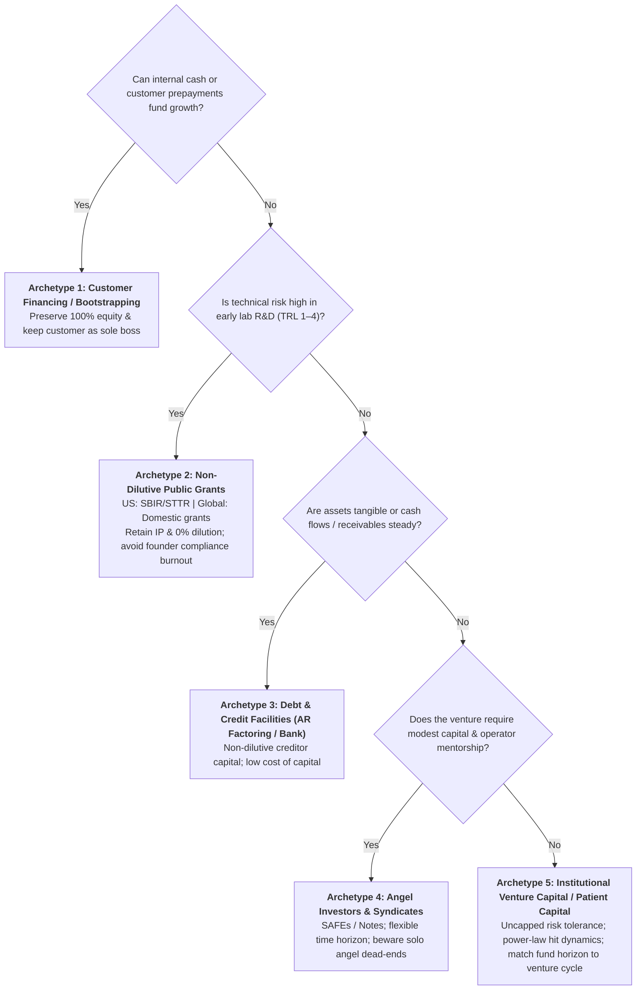

# Stage 5: Venture De-Risking & Capital Architecture

> **Phase Focus:** The Firm as a Cash Engine, Working Capital Optimization, Killer Discriminating Experiments, Staged Financing, Power-Law Investor Alignment, and Capital Taxonomy.

---

## 1. Stage Objective & Theoretical Foundation

Raising external venture capital is not a badge of honor; institutional equity is the most expensive and restrictive capital instrument in existence. Stage 5 architects the venture's financial engine to minimize external dilution, compress the cash conversion cycle, and structure capital deployment around **hypothesis-driven discriminating milestones**.

> **The Entrepreneurial Finance Principle**  
> *"Raising external finance from a venture capital investor is really not necessarily a badge of honor. You do it when all other sources of capital are not feasible, because venture capital is very expensive."*  
> — Prof. Ramana Nanda (Harvard Business School)

---

## 2. Key Concepts & Definitions

### 1. The Operational Cash & Capital Core

- **Invention vs. Innovation:** An *invention* is a novel scientific or technological creation. *Innovation* is commercializing that invention into a self-sustaining business for which customers willingly pay. Scientists frequently fall into the trap of building scientifically "perfect" products that fail to address real customer pain points.
- **The Firm as a Cash Engine:** A transformation machine that takes cash, turns that cash into assets, and turns those assets back into cash plus a return ($\Delta\text{Cash}$).
- **Cash Conversion Cycle (CCC):**
  $$\text{CCC} = \text{Days Inventory Outstanding (DIO)} + \text{Days Sales Outstanding (DSO)} - \text{Days Payables Outstanding (DPO)}$$
  - *Strategic Ideal:* **Negative Working Capital** (customers pay upfront subscriptions or advance deposits before vendor payables are due).
- **The Lemonade Stand Model:** Ramana Nanda's thought experiment proving how payment terms dictate financing requirements:
  - *Model 1 (Cash on Delivery):* Needs \$100 starting float.
  - *Model 2 (Net-30 Invoice / AR):* Needs \$3,000 in working capital debt/equity to survive growth.
  - *Model 3 (Negative Working Capital / Pre-orders):* Needs \$0 external capital; customer prepayments fund growth.

### 2. Venture Staging & Investor Dynamics

- **The 3 Discrete Milestone Inflections:** Rather than focusing on arbitrary round labels (Pre-seed, Seed, Series A), capitalize the venture around three empirical inflection gates:
  1. *Milestone 1 (Pre-Seed / Seed):* Prove that the **technology works** in a relevant operational environment.
  2. *Milestone 2 (Seed / Series A):* Prove **product-market fit** (verifiable customer willingness to pay, compelling use cases, and early unit economics).
  3. *Milestone 3 (Expansion / Series B+):* Prove **scalable execution** (market leadership, repeatable distribution, and dominant category economics).
- **The Co-Determination of Strategy & Financing:** Product-market strategy and financing strategy are co-dependent, joint decisions. The business model determines the cash flow profile, which dictates what capital instruments are feasible; conversely, the capital instruments chosen impose hard constraints on product-market strategy and exit horizons.
- **The Hits / Power-Law Model:** Institutional venture capital is an extreme "hits business." VCs rely on rare home runs to return entire funds. Pitching a "safe, guaranteed \$20M business" is uninvestable because the baseline startup failure rate is high anyway. Winning pitches present an audacious, high-upside state of the world while demonstrating a rigorous, step-by-step experiment roadmap to eliminate lethal failure modes.
- **Fully Diluted Equity & Cap Table Management:** Absolute share numbers ($1\text{M shares}$) are meaningless without knowing the fully diluted share count. Ownership must always be measured as a percentage of total diluted equity (including unexercised options and warrants).
- **The Sahlman Ownership Value Principle:** Maximize the *absolute dollar value* of equity ownership, not the ownership percentage ("a smaller piece of a much larger pie is worth vastly more than a huge piece of a tiny pie"). Who you take money from is often far more important than the specific terms, due to investor value-add in customer access, hiring, and syndicate construction.
- **The Capital Scarcity Discipline Mandate:** Abundant early capital is often toxic to startups ("necessity is the mother of invention"). Capital constraints force teams to prove hypotheses in the leanest, scrappiest way possible, avoiding bloated overhead and untested assumptions.

---

## 3. Core Transformation Activities

1. **Architect for Negative Working Capital:** Structure customer contracts with upfront annual payments, advance milestone deposits, or hardware reservation fees to fund development organically.
2. **Formulate the Killer Discriminating Experiment:** Identify the single assumption that, if false, decisively kills the business; design an experiment to test it immediately before spending capital on secondary features.
3. **Synchronize Technical Milestones with Financing Tranches:** Map Series A capital to the exact metrics (churn, retention, gross margins) required by Series B investors.
4. **Conduct Counterparty Incentive Audits:** Analyze who prospective investors are beholden to (LPs, fund horizon), how they make money (carry vs. management fees), and where structural frictions will emerge.
5. **Preserve Runway Leverage:** Never fundraise with less than 6 months of cash remaining; enter negotiations when recent milestone data has been proven and bank reserves remain healthy.
6. **Exploit the Deep-Tech Cost Collapse:** Leverage modular prototyping, supercomputing simulations (such as nuclear core modeling), CubeSat architectures, and high-throughput CRISPR platforms to de-risk physical science at software-like costs.

---

## 4. Capital Instrument Selection Matrix & Comprehensive Taxonomy

For the comprehensive operational framework—evaluating all 5 capital archetypes (bootstrapping, customer pre-financing, non-dilutive grants, debt/credit, and institutional VC), their dilution costs, governance/control concessions, risk tolerances, and venture stage suitability—consult:
> **[Five Different Capital Types](../structures/five-different-capital-types.md)**  
> *(Also cross-referenced in the [Multi-Criteria Decision Matrices](../structures/decision-matrices.md#2-capital-instrument-selection-matrix), [Cash Engine & Working Capital Calculator](../structures/canvases-and-worksheets.md#worksheet-7-cash-engine--working-capital-calculator), and the [How-To Guide on Pitching and Staged Financing](../guides/how-to-speak-with-investors-and-structure-staged-financing.md).)*

---

## 5. Stage Gate 5: Exit Deliverables

Before advancing to [**Stage 6: Accelerators, Spin-Offs & Syndicate Governance**](./stage-6-spinoffs-and-scaling.md), the venture must possess:

- [ ] Documented **Working Capital Architecture** with optimized CCC metrics and cash engine model.
- [ ] Completed **Killer Discriminating Experiment** proving the core technical/market hypothesis.
- [ ] Formulated **Staged Financing Roadmap** aligned to the 3 discrete inflection gates.
- [ ] Completed **Counterparty Alignment Audit** confirming investor fund horizon, incentive structure, and strategic value-add.
- [ ] Clean **Capitalization Table (Cap Table)** modeled on a fully diluted basis, including options and convertible reserves.
- [ ] Term sheet review strategy balancing cash flow rights (liquidation preferences) with protective control provisions (board seats, vetoes, and down-round protections).
