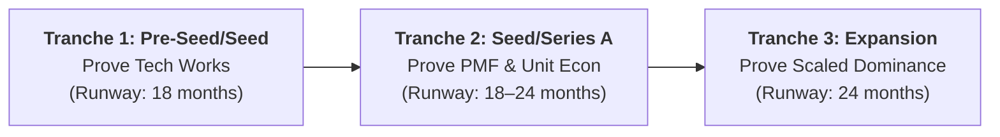

# Actionable Canvases & Diagnostic Worksheets

> **Standardized Worksheets and Templates for Structuring Innovation Projects Across the 6 Stages**

---

## Canvas 1: The Perspective-Heuristic (P-H) Search Canvas

*Use in Stage 2 (Technology-Market Fit) to re-represent an intractable technical or commercial problem.*

- **Project / Technology Name:** [Name]
- **Current Native Domain Representation:** [e.g., Synthetic biology wet-lab protein folding]
- **Current Roadblock / Impasse:** [e.g., Computational time explodes exponentially]

| Coordinate Frame | Imported Perspective (Domain) | Applied Search Heuristic | Predicted Advantage |
|:---:|---|---|---|
| **Perspective A (Native)** | Organic chemistry | Chemical reaction simulation | High accuracy, intractable compute |
| **Perspective B** | Materials science | Polymer crystallization kinetics | 100x acceleration in folding prediction |
| **Perspective C** | Computer graphics | Ray-tracing spatial matrix | Real-time visual approximation |
| **Perspective D** | Crowdsourced network | Open competitive leaderboard | Access to uncorrelated solver profiles |

- **Chosen Representation for Testing:** [Perspective B]
- **Rationale:** [Combines physical accuracy with order-of-magnitude compute reduction]

---

## Canvas 2: Universal Functional Analysis (S-A-O) Worksheet

*Use in Stage 2 (Technology-Market Fit) to deconstruct proprietary technology into universal functions (Dr. Sam Kogan).*

- **Proprietary Artifact Description:** [e.g., Nanoporous ceramic gas separation membrane]

### Step 1: Strip Domain Jargon
- **Jargon terms removed:** "ceramic matrix", "nanoporous hydrocarbon filter", "refinery catalytic tube"
- **Physical state:** Solid porous barrier with controlled pore diameter

### Step 2: Subject-Action-Object (S-A-O) Triads
1. **[Membrane]** + **[Separates]** + **[Molecules by Size]**
2. **[Pore Structure]** + **[Stops]** + **[Particulate Contaminants]**
3. **[Substrate]** + **[Withstands]** + **[High Thermal Gradient]**

### Step 3: Cross-Industry Application Search
| S-A-O Triad | Analogous Industry Domain | Potential Commercial Application |
|---|---|---|
| *Separates molecules* | Industrial Food Processing | Cold concentration of fruit juices without boiling |
| *Stops contaminants* | Semiconductor Manufacturing | Ultrapure chemical wash filtration |
| *Withstands thermal gradient* | Aerospace Propulsion | Lightweight thermal insulation for exhaust nozzles |

---

## Canvas 3: Customer Activity Chain & Linkages Worksheet

*Use in Stage 2 (Technology-Market Fit) to map customer friction across the full operational journey (Prof. Vish Krishnan).*

- **Target Customer Archetype:** [e.g., Hospital Head of Emergency Medicine]
- **Core Job-to-Be-Done:** [Rapid, accurate triage of acute polytrauma patients]

| Step | Activity Link | Functional Friction | Economic / Time Cost | Informational Friction | Emotional / Risk Anxiety |
|:---:|---|---|---|---|---|
| **1** | **Scan Patient** | Patient transport delay | ED bed blocked (2 hrs) | Missing prior health record | Fear of unseen hemorrhage |
| **2** | **Upload to PACS** | DICOM formatting errors | IT bandwidth strain | Fragmented visual slices | Fear of missing slice 142 |
| **3** | **Radiologist Read** | Radiologist backlog | $120/scan contractor fee | Preliminary report delay | Overnight fatigue liability |
| **4** | **Triage & Decision** | Manual phone call to ED | 45-min triage queue | Conflicting clinical notes | Risk of delayed surgery |
| **5** | **Discharge / Admit** | Administrative EHR entry | $2,400 unnecessary admit | Bed utilization opacity | Patient family frustration |

- **Decisive Point of Intervention:** [Step 3 & 4: Automated AI preliminary triage within 5 minutes]

---

## Canvas 4: Business Architecture Alignment Canvas

*Use in Stage 3 to verify harmony between the Business Model and Operating Model.*

### Pillar I: Business Model
- **Value Creation Strategy:** [Differentiation / Cost Advantage / Network Effects]
  - *Core Customer Benefit:* [e.g., 40% reduction in diagnostic turnaround time]
  - *Decisive MPV:* [Speed: <5 minutes vs. 2 hours]
- **Value Capture Model:** [Annual SaaS / Metered Pay-per-Use / IP Licensing]
  - *Pricing Metric:* [$50,000/facility base fee + $12,000/scanner/year]
  - *Target Contribution Margin:* [80%]

### Pillar II: Operating Model
- **Structure:** [Product Firm / Service Firm / Platform Matchmaker]
- **Capabilities Required:**
  1. [FDA 510(k) Class II SaMD regulatory compliance]
  2. [PACS / EHR integration engineering (HL7 / DICOM / FHIR)]
  3. [Enterprise hospital value-analysis committee selling]
- **Assets Required:**
  1. [Proprietary multimodal 3D vision model weights]
  2. [Multi-center clinical validation trial datasets]
  3. [Granted patent claims covering inference optimization]

### Alignment Stress Test
- [ ] Does the operating cost per delivery allow the target gross contribution margin?
- [ ] Can our structure deliver the volume promised by the pricing model?
- [ ] Are required capabilities buildable with current team or capital budget?

---

## Canvas 5: Cloverleaf Due Diligence Diagnostic Canvas

*Use in Stage 4 to stress-test the venture across all four leaves before fundraising.*

*Scoring: 1 (Fatal Deficiency / Unresolved) to 5 (Defensible / Independently Validated)*

| Leaf | Evaluation Dimension | Score (1–5) | Key Evidence / Rationale | Red Flag Action Required |
|---|---|:---:|---|---|
| **Leaf 1: Tech & IP** | TRL 5/6 Operational Robustness | `[ ]` | Benchtop tests complete; field tests ongoing | Run environmental noise stress tests |
| **Leaf 1: Tech & IP** | Freedom to Operate (FTO) Clearance | `[ ]` | Formal patent counsel search conducted | Review claim 4 of competitor patent |
| **Leaf 2: Market** | Urgent Unmet Customer Need | `[ ]` | 45 customer interviews confirm #1 pain | Validate willingness to pay with LOIs |
| **Leaf 2: Market** | 10x Performance / Cost Leap | `[ ]` | Diagnostic speed: 5 min vs 2 hrs (24x) | Benchmark against next-gen competitor |
| **Leaf 3: Business** | Positive Unit Contribution Margin | `[ ]` | Software delivery cost is <10% of price | Verify customer acquisition cost (CAC) |
| **Leaf 3: Business** | Defensible Pricing Power | `[ ]` | Multi-year contracts with ARR lock-in | Evaluate customer switching costs |
| **Leaf 4: Ops & Team** | Regulatory & Compliance Pathway | `[ ]` | FDA 510(k) predicate identified | Retain former FDA reviewer consultant |
| **Leaf 4: Ops & Team** | Founding Team Execution Capability | `[ ]` | Tech + clinical co-founders aligned | Recruit commercial B2B sales lead |

- **Composite Venture Readiness Score:** `[  / 40]`

---

## Canvas 6: Deep-Tech MVP & Killer Experiment Canvas

*Use in Stage 4 & 5 to isolate and invalidate existential market and financial risks.*

- **Existential Venture Hypothesis:** [e.g., Radiologists will trust and adopt AI preliminary triage findings during overnight emergency shifts without re-reading all negative scans]

### Step 1: Invalidation Criteria
- *What specific empirical result DECISIVELY KILLS this hypothesis?*
  [If >30% of emergency physicians reject the preliminary AI findings and demand human subspecialist re-reads before clinical triage]

### Step 2: MVP Archetype Selection
- [ ] Conceptual MVP (Scenario Walkthrough)
- [ ] Simulated MVP (Wizard of Oz / Human-in-the-Loop)
- [ ] Prototypical MVP (Functional Benchtop Hardware)

### Step 3: Experiment Protocol
- **Test Cohort:** 15 emergency hospital physicians during simulated night-shift scenarios.
- **Workflow Simulation:** Physicians receive incoming traumatic CT scans with structured AI summaries. (Unbeknownst to them, summaries are drafted in real time by an off-site senior clinical radiologist).
- **Metric Measured:** Speed to decision, clinical trust rating, and percentage of scans ordered for human re-read.
- **Budget & Duration:** $4,500 and 10 days.

### Step 4: Decision Rule
- If Re-read Request Rate is < 10% → **PROCEED** to staged Series A financing.
- If Re-read Request Rate is ≥ 30% → **PIVOT** architecture (reposition as radiologist copilot, not autonomous triage).

---

## Canvas 7: Cash Engine & Working Capital Calculator

*Use in Stage 5 to model the Cash Conversion Cycle (Prof. Ramana Nanda).*

### Parameters
- **Daily Operating Burn / Cost of Goods Sold (COGS):** $10,000 / day (Example)
- **Daily Gross Revenue Generated:** $15,000 / day (Example)
- **Days Inventory Outstanding (DIO):** 45 days
- **Days Sales Outstanding (DSO):** 60 days (Accounts Receivable payment collection delay)
- **Days Payables Outstanding (DPO):** 30 days (Supplier payment window)

### Calculation
$$\text{Cash Conversion Cycle (CCC)} = \text{DIO} + \text{DSO} - \text{DPO}$$

$$\text{Trapped Working Capital} = \text{Daily COGS} \times \text{CCC}$$

### Optimization Levers
1. *Convert DSO to Negative:* Shift enterprise accounts from Net-60 invoices to annual upfront prepaid contracts (DSO → -365 days).
2. *Eliminate DIO:* Transition from stocking manufactured inventory to just-in-time dropship contract manufacturing.
3. *Extend DPO:* Negotiate Net-60 terms with foundational cloud providers and hardware component vendors.

---

## Canvas 8: Investor Counterparty Alignment & Incentive Audit

*Use in Stage 5 to systematically evaluate prospective investors before signing term sheets (Prof. Ramana Nanda).*

- **Prospective Investment Firm:** [Enter Firm Name, e.g., Benchmark / Founders Fund]
- **Fund Structure & Vintage:** [e.g., Fund IV, $250M, 10-year closed-end LP fund, Year 3 of investment cycle]

| Forensic Dimension | Diagnostic Inquiry | Venture Evaluation / Findings | Alignment Status (Green / Amber / Red) |
|---|---|---|:---:|
| **1. Counterparty Mandate** | Who are the LPs? What is the expected fund liquidation timeline? | Institutional pension funds; 10-year hard close | [Amber / Red if venture requires 12+ years] |
| **2. Monetization Engine** | Are returns driven by 20% carry on rare outliers, or asset-gathering management fees? | 20% carry; requires $1B+ enterprise value | [Green for power-law upside alignment] |
| **3. Value-Add Beyond Capital** | What specific customer intros, executive hiring, or syndicate partners can they deliver? (Bill Sahlman Rule) | Direct connections to Fortune 500 clinical pilots | [Green — increases terminal pie value] |
| **4. Governance Friction Points** | What veto thresholds, board seats, or liquidation preferences are demanded? | Demands $1\times$ non-participating, 1 board seat | [Green — standard clean terms] |
| **5. Follow-On Signaling Risk** | Can they lead the next round, or will passing create a fatal toxic signal? | Reserved 2x initial check for follow-on | [Green — prevents insider signaling penalty] |

---

## Canvas 9: Staged Milestone & Experiment Financing Roadmap

*Use in Stage 5 to map technical milestones to financing tranches and next-round investor expectations (Prof. Ramana Nanda).*

| Venture Stage | Target Inflection Gate | Capital Required (Benchmark) | Runway Budgeted | Discriminating Metric / Deliverable | Next-Round Investor Expectation |
|---|---|---|---|---|---|
| **Inflection 1 (Pre-Seed / Seed)** | **Technology Works** | $250K – $2M | 18 mo (12 mo test + 6 mo cushion) | Functional benchtop/simulated prototype; preliminary FTO | Technical feasibility verified by domain specialists |
| **Inflection 2 (Seed / Series A)** | **Product-Market Fit & Unit Economics** | $2M – $10M | 18–24 mo | Signed pilot contracts; paid LOIs; gross margins > 60%; churn < 1.5%/mo | Verifiable commercial demand and positive unit contribution |
| **Inflection 3 (Expansion / Series B+)** | **Scaled Market Dominance** | $10M – $50M+ | 24 mo | Scaled ARR / gross profit; category distribution; low CAC | Market leadership, repeatable sales engine, defensible moat |

---

## Canvas 10: Fully Diluted Ownership & Cap Table Planner

*Use in Stage 5 & 6 to model equity dilution, option pools, and terminal founder wealth (Bill Sahlman & Ramana Nanda).*

### Cap Table Structure Example
- **Current Common Shares:** 10,000,000 shares
- **Unexercised Stock Options:** 1,500,000 shares
- **Warrants / Convertible Notes / SAFEs:** 500,000 shares equivalent
- **Total Fully Diluted Shares:** 12,000,000 shares

### The Pie Maximization Calculation
$$\text{Founder Terminal Wealth} = \text{Fully Diluted Ownership (\%)} \times \text{Terminal Valuation (\$)}$$

| Scenario | Investor Lead | Pre-Money Valuation | Investment Amount | Post-Money Valuation | New Dilution | Founder Fully Diluted % | Expected Terminal Valuation (with Investor Support) | Founder Net Terminal Equity Value |
|---|---|---|---|---|---|---|---|---|
| **Scenario A (Terms Focus)** | Passive Fund | $15,000,000 | $3,000,000 | $18,000,000 | 16.7% | 45.0% | $40,000,000 (Low support) | **$18,000,000** |
| **Scenario B (Value Focus - Sahlman Axiom)** | Top-Tier Strategic VC | $12,000,000 | $4,000,000 | $16,000,000 | 25.0% | 38.0% | $120,000,000 (High support) | **$45,600,000** |

*Conclusion: Scenario B yields $27.6M more terminal founder wealth despite 7% higher dilution, proving Bill Sahlman's rule that who you take money from matters more than initial terms.*

