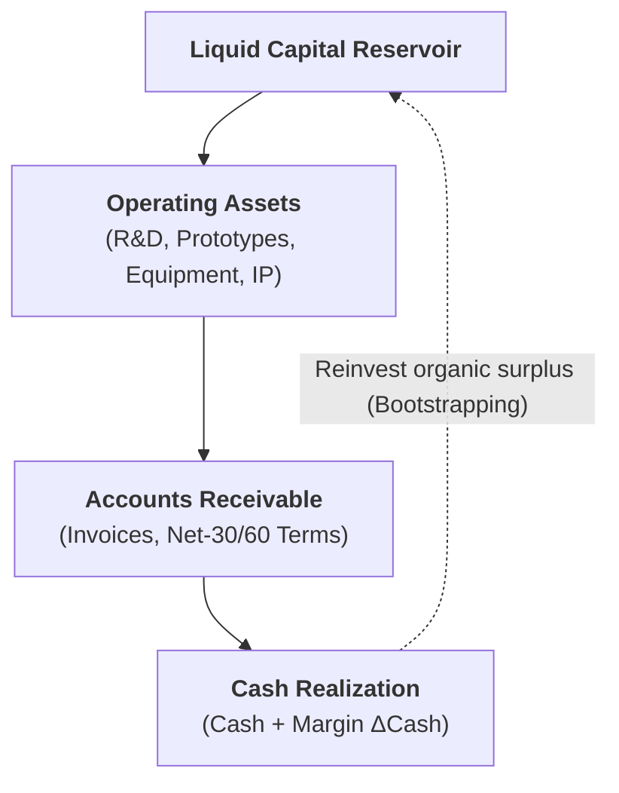
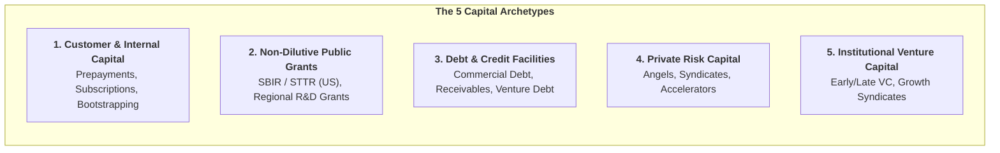
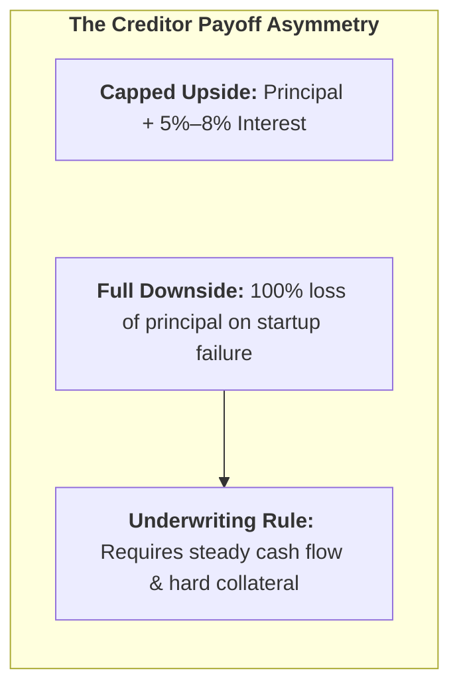
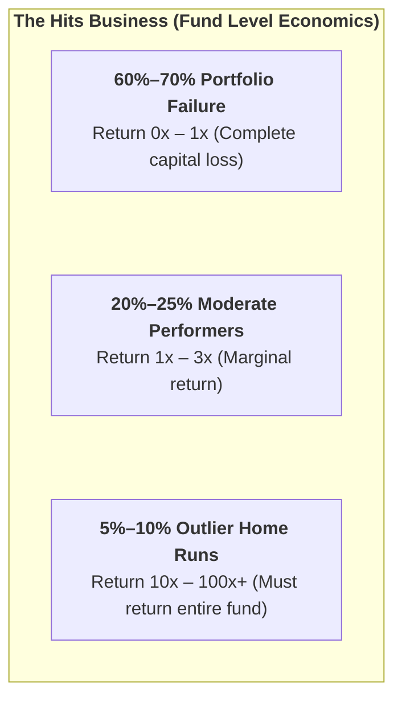
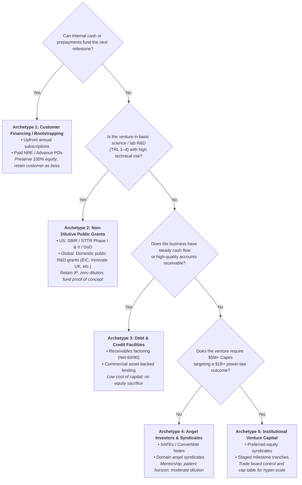

# Five Different Capital Types

> **Capital Taxonomy & Funding Selection Architecture: A Systematic Operational Framework for Categorizing Financing Instruments, Evaluating Risk-Return Asymmetries, and Architecting Staged Venture Capitalization.**  
> *Derived from Harvard Business School Technology Entrepreneurship (Prof. Ramana Nanda, Prof. Karim Lakhani, Prof. Tom Nicholas, Warren Katz, and Conrad Hollomon).*

---

## 1. Executive Summary & Governing Principles

In technology commercialization, capital is not a scoreboard or a badge of honor—it is a specific operational tool with legal, structural, and governance consequences. Raising external institutional equity is the most expensive and restrictive capital instrument in existence. 

### The Four Governing Mandates
1. **The Entrepreneurial Finance Principle (Prof. Ramana Nanda):**  
   *"Raising external finance from a venture capital investor is not a badge of honor. You do it when all other sources of capital are not feasible, because venture capital is very expensive."*
2. **The 100% Brain Allocation Rule (Warren Katz):**  
   Founders possess 100% of their cognitive bandwidth. Every percent dedicated to pitching, managing, and reporting to investors is stolen from customer discovery, product iteration, and market validation.
3. **The Governance Boss Rule (Conrad Hollomon):**  
   *"You will always have a boss. The longer you can keep that boss your customer and not someone between you and your customer, the happier and more resilient you will be."*
4. **The Cash Engine Mandate:**  
   Maximize margin ($\Delta\text{Cash}$) and minimize working capital trapped in intermediate operational assets by compressing the Cash Conversion Cycle (CCC) toward **Negative Working Capital**.

---

## 2. Master Capital Instrument Evaluation Matrix

Before analyzing the specific operational mechanics of individual funding pathways, use this multi-criteria matrix to evaluate candidate capital instruments across dilution costs, governance loss, technical risk tolerance, access velocity, and venture stage suitability.

### Multi-Criteria Comparative Matrix

| Capital Category | Specific Instrument | Equity Dilution | Governance & Control Loss | Tolerance for Technical Risk | Speed to Access Capital | Primary Advantage | Existential Hazard | Optimal Venture Need & Stage |
|---|---|---|---|---|---|---|---|---|
| **Customer / Internal** | **Bootstrapping** | **Zero (0%)** | **None** | Low (needs early cash) | Immediate | Absolute founder autonomy & focus | Starvation; slow scaling velocity | Low-Capex software, services (TRL 5–9) |
| **Customer / Internal** | **Advance Prepayments & Subscriptions** | **Zero (0%)** | **None** | Moderate | Fast (upon contract close) | Negative working capital; customer as only boss | Fulfillment defaults if product delays | SaaS, enterprise recurring workflows |
| **Customer / Internal** | **Paid NRE / Joint Co-Dev** | **Zero (0%)** | Minimal (contractual scope) | High | Moderate (negotiation dependent) | Enterprise funds custom R&D; guaranteed adoption | Becoming a custom services agency; IP loss | Enterprise deep tech, robotics, aerospace |
| **Customer / Internal** | **Conditional Advance Purchase Orders** | **Zero (0%)** | **None** | High | Fast | Ultimate proof of demand; bankable instrument | Inability to deliver specs triggers cancellation | Hardware, medical devices, sensors |
| **Public Grants** | **SBIR / STTR Grants (Phase I & II — US)** | **Zero (0%)** | **None** (Government takes no equity/board) | **Extreme (TRL 1–4)** | **Slow (6–12 months)** | Retained IP; non-dilutive $1.5M+ seed replacement | Bureaucratic distraction; slow capital cycle; US-only eligibility | Early science, lab spin-outs, biotech (TRL 1–4) |
| **Public Grants** | **Defense Innovation & Dual-Use Contracts** | **Zero (0%)** | Minimal (security compliance) | Very High | Moderate to Slow | Non-dilutive scale; lead government customer | ITAR restrictions; dual-use lock-in; defense requirements | Robotics, autonomous systems, cybersecurity |
| **Public Grants** | **International / Domestic Public Grants (Global)** | **Zero (0%)** | None | Extreme to High | Slow (3–9 months) | Non-dilutive R&D support (EIC, Innovate UK, NAFOSTED, etc.) | Compliance overhead; regional eligibility constraints | Deep tech in non-US jurisdictions |
| **Debt & Credit** | **Commercial Bank Lending** | **Zero (0%)** | Low (strict covenants) | **Zero (Requires cash flow)** | Fast | Capped cost; no equity loss | Foreclosure/bankruptcy on missed debt service | Post-revenue cash-flow-positive scaling |
| **Debt & Credit** | **Receivables Financing (Factoring)** | **Zero (0%)** | None | Low | Fast (immediate against invoice) | Bridges Net-60/90 invoice collection lag | High factoring fees compress gross margins | Scaling B2B firms with positive working capital |
| **Debt & Credit** | **Venture Debt** | Minimal (1%–3% warrants) | Moderate (negative covenants) | Low to Moderate | Fast (requires VC backing) | Extends runway without setting valuation cap | Liquidity trap if Series B equity fails | VC-backed companies between equity rounds |
| **Private Risk Capital** | **Friends & Family** | Low to Moderate (5%–10%) | None | High | Immediate | Patient, forgiving capital | Severe personal relationship strain | Pre-seed ideation & entity formation |
| **Private Risk Capital** | **Angel Investors & Syndicates** | Moderate (10%–20%) | Low (advisory boards) | Very High | Fast to Moderate (weeks) | Flexible horizons; operator mentorship | Solo angel dead end; cap table clutter | Seed validation; killer experiments (TRL 3–6) |
| **Private Risk Capital** | **Accelerators (YC, Techstars)** | Fixed (7%–10%) | Low | High | Fast (cohort cycles) | Rapid fundraising momentum & peer network | Uniform dilution regardless of technology depth | Early-stage tech seeking network & velocity |
| **Institutional VC** | **Early-Stage VC (Series Seed/A/B)** | **Extreme (15%–30% per round)** | **High (Board seats, veto rights)** | **Very High (Funds breakthroughs)** | **Moderate (3–6 months)** | Multi-million follow-on capacity; syndicate power | Portfolio asymmetry; signaling risk; 10-yr pressure | Deep tech, high-Capex, massive TAM (TRL 5–8) |
| **Institutional VC** | **Late-Stage Growth Equity** | Moderate to High | High (protective provisions) | Low (execution risk only) | Moderate | Mass scaling liquidity; pre-IPO readiness | High liquidation preferences; down-round ratchets | Proven unit economics; dominant market share |
| **Institutional VC** | **Corporate Venture Capital (CVC)** | Moderate (strategic checks) | Moderate (commercial rights) | High | Slow (corporate committees) | Strategic distribution channels & supply chain | Competitor resistance; corporate strategy shifts | High-Capex joint manufacturing & distribution |

---

## 3. Detailed Capital Taxonomy & Archetype Analysis

---

### Archetype 1: Customer & Internal Capital (Non-Dilutive / Organic)

The highest-fidelity, lowest-cost capital available to any enterprise. Cash flows directly from commercial counterparties based on genuine willingness to pay.

#### 1.1 Bootstrapping & Founder Sweat Equity
* **Mechanism:** Self-funding via personal savings, consulting surplus, and retained operational cash flows.
* **Benefits:**
  * **100% Ownership & Autonomy:** Zero cap table dilution; complete strategic freedom without external vetoes.
  * **Operational Discipline:** Enforces radical frugality and forces immediate focus on cash-generating activities.
* **Risks & Trade-Offs:**
  * **Severe Scale Velocity Constraints:** Capital injection is limited by organic revenue pace.
  * **Personal Financial Vulnerability:** Founders absorb total downside liability.
  * **The "Software Fallacy in Deep Tech":** Unviable for deep technologies requiring multi-million-dollar wet labs, clinical trials, or physical fabrication prior to revenue.
* **Suitable For:** Digital software, SaaS MVPs, consulting-to-product transitions, asset-light platforms at TRL 5–9.

#### 1.2 Advance Customer Prepayments & Subscription Financing (Lemonade Model 3)
* **Mechanism:** Customers pay upfront before delivery (annual upfront SaaS subscriptions, upfront pilot integration fees, retainer deposits).
* **Benefits:**
  * **Negative Working Capital:** Customers finance ongoing operations and product delivery.
  * **Zero Dilution & Covenants:** Replaces equity checks without board seats or legal encumbrances.
* **Risks & Trade-Offs:**
  * Requires substantial initial credibility or urgent customer pain.
  * Fulfillment liability if delivery timeline slips.
* **Suitable For:** B2B enterprise software, mission-critical workflow tools, high-demand industrial components.

#### 1.3 Paid Co-Development & Non-Recurring Engineering (NRE)
* **Mechanism:** Enterprise anchor clients fund specific engineering development or customization via paid milestone contracts.
* **Benefits:**
  * Direct enterprise validation and non-dilutive R&D capitalization.
  * Guaranteed first reference customer upon milestone completion.
* **Risks & Trade-Offs:**
  * **Product Distortion Risk:** Danger of becoming a custom software/services shop tailored to one client's idiosyncratic legacy stack.
  * IP assignment disputes if contracts are poorly structured.
* **Suitable For:** Complex B2B deep-tech adaptations, aerospace/defense subsystems, robotics automation pilots.

#### 1.4 Conditional Advance Purchase Orders (The Ultimate Demand Signal)
* **Mechanism:** Legally binding purchase orders (POs) that trigger automatic payment upon meeting specified technical acceptance criteria.
* **Benefits:**
  * Incontrovertible validation of authentic market demand ("where there's smoke, there's fire").
  * Bankable instrument that can unlock non-dilutive purchase-order financing.
* **Risks & Trade-Offs:**
  * Penalties or loss of customer if technical milestones fail.
* **Suitable For:** Hardware, advanced manufacturing, medical diagnostic equipment.

#### 1.5 Rewards-Based Crowdfunding (Kickstarter, Indiegogo)
* **Mechanism:** Public pre-orders from prospective end-users to fund first production runs.
* **Benefits:**
  * Validates consumer willingness to pay, builds early brand advocates, and generates non-dilutive cash.
* **Risks & Trade-Offs:**
  * High public failure visibility; manufacturing cost overruns can cause bankruptcy during fulfillment.
  * Irrelevant for enterprise B2B or regulated life sciences.
* **Suitable For:** Consumer hardware, smart devices, novel lifestyle/gaming products.

---

### Archetype 2: Non-Dilutive Public & Exploratory Grant Capital

Government-backed feasibility capital explicitly designed to absorb early technical risk where private markets fail.

> [!IMPORTANT] Jurisdictional Scope & Global Equivalent Programs
> **SBIR/STTR and Defense Innovation programs are United States-specific.** They strictly require US legal incorporation, majority ownership by US citizens or lawful permanent residents, and R&D activities conducted within the US. 
>
> **Action for Founders:**
> - **US-Based Ventures:** Prioritize federal SBIR/STTR Phase I/II allocations and DoD challenge grants before surrendering dilutive seed equity.
> - **International / Non-US Ventures:** Founders outside the US must actively target their jurisdiction's corresponding non-dilutive public research bodies, such as:
>   - **European Union:** European Innovation Council (EIC Accelerator / Pathfinder), Horizon Europe.
>   - **United Kingdom:** Innovate UK Smart Grants.
>   - **Singapore / Southeast Asia:** Enterprise Singapore (Startup SG Tech), National Research Foundation (NRF).
>   - **Vietnam:** National Foundation for Science and Technology Development (NAFOSTED), National Technology Innovation Fund (NATIF), VinIF.
>   - **Australia / Canada:** CSIRO Kick-Start, NRC Industrial Research Assistance Program (NRC-IRAP).

#### 2.1 SBIR / STTR Federal Grants (Phase I & Phase II — US Only)
* **Mechanism:** Competitive federal grants (NSF, NIH, DoD, DOE, DARPA) awarding ~$250,000 (Phase I: Feasibility) and ~$1,500,000+ (Phase II: Prototyping) for US small businesses.
* **Benefits:**
  * **Zero Dilution:** Exactly 0% equity, warrants, or liquidation preferences surrendered.
  * **Retained IP:** Bayh-Dole Act ensures the small business retains title to patents developed under federal funding.
  * **Institutional Stamp of Approval:** Peer-reviewed technical validation increases downstream VC credibility.
* **Risks & Trade-Offs:**
  * **Cognitive Bandwidth Tax:** Heavy bureaucratic applications, rigid accounting compliance, and audit requirements (Warren Katz's Bandwidth warning).
  * **Slow Capital Velocity:** 6 to 12-month review and disbursement cycles.
  * **"Grant Mill" Hazard:** Risk of trapping PhD founders in endless research cycles without commercial market pressure.
* **Suitable For:** Early-stage deep tech, novel materials, therapeutics, synthetic biology, and quantum technologies at TRL 1–4.

#### 2.2 Defense Innovation & Dual-Use Prototype Contracts (US DoD & Allies)
* **Mechanism:** Expedited defense contracting (AFWERX, DIU, DARPA, In-Q-Tel) funding dual-use national security and commercial applications.
* **Benefits:**
  * Government acts as lead customer and early operational testbed.
  * Large, reliable non-dilutive funding checks with follow-on procurement programs.
* **Risks & Trade-Offs:**
  * ITAR/export restrictions, security clearance friction, and commercialization locks.
* **Suitable For:** Autonomous systems, aerospace, cybersecurity, advanced sensors, robotics.

---

### Archetype 3: Debt & Credit Facilities (Non-Dilutive Creditor Capital)

Fixed repayment obligations with capped upside for the lender.

#### 3.1 Commercial Bank Lending & Asset-Backed Credit
* **Mechanism:** Term loans, lines of credit, or equipment financing backed by liquidation collateral or positive EBITDA.
* **Benefits:**
  * Cheap cost of capital; zero equity dilution or board governance loss.
* **Risks & Trade-Offs:**
  * **Completely Unviable for Pre-Revenue Startups:** Because banks face full downside with zero equity upside, they cannot rationally fund binary technological or market risk.
  * Default triggers immediate debt acceleration and bankruptcy/asset foreclosure.
* **Suitable For:** Established post-revenue ventures with profitable cash flows, or purchasing standardized equipment with liquid secondary markets.

#### 3.2 Working Capital & Accounts Receivable Financing (Factoring)
* **Mechanism:** Borrowing against outstanding Net-30/60/90 enterprise invoices (factoring or receivables line).
* **Benefits:**
  * Bridges the cash gap in positive working capital models (Lemonade Model 2); prevents growth-induced bankruptcy.
* **Risks & Trade-Offs:**
  * High effective APR (factoring discounts reduce gross margins).
  * Dependent on the credit rating of enterprise buyers.
* **Suitable For:** Rapidly scaling B2B companies with confirmed enterprise receivables trapped by payment terms.

#### 3.3 Venture Debt
* **Mechanism:** Specialized multi-million-dollar loans provided to VC-backed startups, packaged with small equity warrants (1%–3%).
* **Benefits:**
  * Extends operational runway between Series A and Series B without setting a new equity valuation cap; less dilutive than equity.
* **Risks & Trade-Offs:**
  * Requires existing institutional VC backing; debt covenants and liens on company IP; default can wipe out common shareholders.
* **Suitable For:** Post-Series A/B companies with predictable growth metrics seeking runway extension to hit a valuation inflection point.

---

### Archetype 4: Private Early-Stage Risk Capital

Discretionary private capital deployed into early-stage discovery and validation.

#### 4.1 Friends & Family Round
* **Mechanism:** Informal early checks from personal acquaintances ($10k–$100k).
* **Benefits:**
  * Rapid execution, highly forgiving terms, minimal diligence friction.
* **Risks & Trade-Offs:**
  * Threatens personal relationships upon venture failure; investors typically provide zero strategic value.
* **Suitable For:** Pre-seed concept validation and initial legal incorporation.

#### 4.2 Angel Investors & Angel Syndicates
* **Mechanism:** Discretionary capital from high-net-worth individuals, tech executives, or organized syndicates via SAFEs or Convertible Notes.
* **Benefits:**
  * **Flexible Horizons:** Angels invest their own balance sheet—no 10-year LP fund mandate or forced exit timetable.
  * **Domain Mentorship:** Direct operator guidance, technical critique, and customer introductions.
  * **Simpler Governance:** Typically no formal board seats or restrictive veto powers.
* **Risks & Trade-Offs:**
  * **Shallow Reserves ("The Solo Angel Dead End"):** Angels cannot defend the cap table or fund multi-million-dollar downstream rounds.
  * Unaccredited or misaligned angels can create messy cap tables.
* **Suitable For:** TRL 3–6 de-risking, funding the "Killer Discriminating Experiment," building the functional MVP.

#### 4.3 Accelerators & Seed Funds
* **Mechanism:** Structured 3-month programs (Y Combinator, Techstars) providing ~$125k–$500k in exchange for 7%–10% equity plus curriculum and demo day exposure.
* **Benefits:**
  * High-intensity peer network, rapid fundraising momentum, institutional investor pipeline.
* **Risks & Trade-Offs:**
  * Standardized fixed equity dilution regardless of prior technical maturity.
* **Suitable For:** First-time founders, teams needing commercial network access, rapid SaaS validation.

---

### Archetype 5: Institutional Venture Capital & Strategic Syndicates

Institutional capital managed by General Partners (GPs) on behalf of Limited Partners (LPs). Deployed into extreme power-law distributions.

#### 5.1 Early-Stage Venture Capital (Series Seed, A, B)
* **Mechanism:** Institutional funds investing $1M–$15M+ in exchange for preferred equity (15%–25% dilution per round).
* **Benefits:**
  * **Deep Capital Reserves:** Multi-million-dollar firepower to build complex lab infrastructure, hire elite engineering teams, and absorb years of burn.
  * **Syndicate Clout:** Co-investment relationships bring downstream Series B/C growth investors.
  * **Radical Risk Absorption:** Rational willingness to fund binary technical breakthroughs with zero collateral.
* **Risks & Trade-Offs:**
  * **Extreme Equity Dilution:** Founders surrender massive portions of ownership across successive rounds.
  * **Governance Friction:** Mandatory board seats, loss of operational independence, and negative control vetoes (blocking subsequent financing, sales, or executive hires).
  * **Portfolio Asymmetry:** A $50M exit that is life-changing for the founder is deemed a total write-off by a $500M VC fund needing a $1B+ liquidity event.
  * **The 10-Year Clock:** Fixed 10-year fund lifecycles force artificial scaling and premature exit pressure.
  * **Signaling Risk:** If an inside VC fails to follow on in the next round, the market interprets it as a fatal flaw, freezing external capital.
* **Suitable For:** Capital-intensive deep tech, breakthrough therapeutics, network-effect platforms, and multi-billion-dollar category creation at TRL 5–8.

#### 5.2 Late-Stage Growth Equity
* **Mechanism:** Large checks ($20M–$100M+) from institutional funds (crossover funds, sovereign wealth) targeting market saturation prior to IPO/M&A.
* **Benefits:** Massive expansion liquidity; institutional balance sheet credibility.
* **Risks & Trade-Offs:** Strict performance covenants, ratchets, and liquidation hurdles.
* **Suitable For:** TRL 8–9 companies with proven unit economics, repeatable CAC/LTV, and dominant market positioning.

#### 5.3 Corporate Venture Capital (CVC) & Strategic Joint Ventures
* **Mechanism:** Equity arms of major corporations (e.g., Intel Capital, Google Ventures, pharma venture funds).
* **Benefits:** Instant distribution channels, supply chain purchasing discounts, validation by industry leaders.
* **Risks & Trade-Offs:**
  * Competitors of the corporate investor will refuse to buy your product or partner with you.
  * Corporate parent shifts strategy, stranding the startup.
* **Suitable For:** Capital-intensive ventures requiring specialized manufacturing infrastructure or corporate distribution channels.

---

## 4. Multi-Criteria Capital Selection Logic

---

## 5. Operational Implementation Guidelines

### 1. Sequence Before Diluting
Never raise institutional equity to answer questions that could have been resolved via customer discovery, desktop modeling, or non-dilutive feasibility grants. The cost of equity is inversely proportional to de-risking:

$$\text{Valuation} \approx \frac{1}{\text{Unresolved Fatal Assumptions}}$$

### 2. Guard Against the Signaling Risk Trap
When accepting money from seed VC funds or corporate venture arms:
- Ensure the investor has explicit follow-on reserves dedicated to your stage.
- Be conscious that an inside investor refusing to participate in a Series A signals catastrophic private information to external syndicates.

### 3. Maintain the Staged Financing Cadence
Structure every capital tranche around a **Discriminating Experiment** (The "Killer Experiment"):
- Tranche 1: De-risk physics / boundary technical feasibility.
- Tranche 2: De-risk customer willingness to pay (the Dog Food test).
- Tranche 3: De-risk unit economics and contribution margin at scale.

---

## 6. Cross-References & Related Documentation
- [Stage 6: Venture De-Risking & Capital Architecture](../stages/stage-6-venture-derisking-and-capital.md)
- [Multi-Criteria Decision Matrices](./decision-matrices.md)
- [Actionable Canvases & Diagnostic Worksheets](./canvases-and-worksheets.md)
