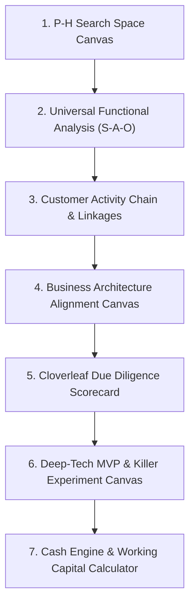

# Innovation Structures, Canvases & Decision Frameworks

> **Operational Toolkits, Diagnostic Canvases, and Multi-Criteria Decision Matrices for Systematic Commercialization**

---

## Overview

Frameworks transform abstract theory into operational execution. This directory provides standardized, repeatable artifacts that research teams, venture builders, and founders can deploy directly to evaluate opportunities, structure experiments, and make high-stakes strategic choices.

---

## Directory Navigation

| Document | Focus | Contents |
|---|---|---|
| [**`canvases-and-worksheets.md`**](./canvases-and-worksheets.md) | **Actionable Canvases** | 7 structured worksheets: P-H Search Canvas, S-A-O Functional Analysis, Customer Activity Chain, Business Architecture Alignment, Cloverleaf Diagnostic, Deep-Tech MVP Canvas, and Cash Engine Calculator. |
| [**`decision-matrices.md`**](./decision-matrices.md) | **Decision Architectures** | 3 strategic matrices: Commercialization Pathway Selector, Capital Instrument Decision Matrix, and GTM Entry Route Matrix. |
| [**`five-different-capital-types.md`**](./five-different-capital-types.md) | **Capital Taxonomy & Selection** | Comprehensive 5-archetype funding framework: benefits, risks, cost of dilution, governance control loss, risk tolerance, and suitability logic. |

---

## The 7 Core Innovation Canvases

1. **P-H Search Space Canvas:** Map alternative coordinate systems to break representational inertia.
2. **Universal Functional Analysis:** Deconstruct proprietary components into elementary physical actions.
3. **Customer Activity Chain:** Diagnose functional, economic, informational, and emotional friction across user workflows.
4. **Business Architecture Alignment:** Audit the fit between Value Creation/Capture and Structure/Capabilities/Assets.
5. **Cloverleaf Due Diligence Scorecard:** Audit venture readiness across Technology, Market, Monetization, and Operations.
6. **Deep-Tech MVP & Killer Experiment Canvas:** Formulate discriminating hypotheses and design Wizard of Oz prototypes.
7. **Cash Engine & Working Capital Calculator:** Model Cash Conversion Cycles and minimize external capital requirements.
